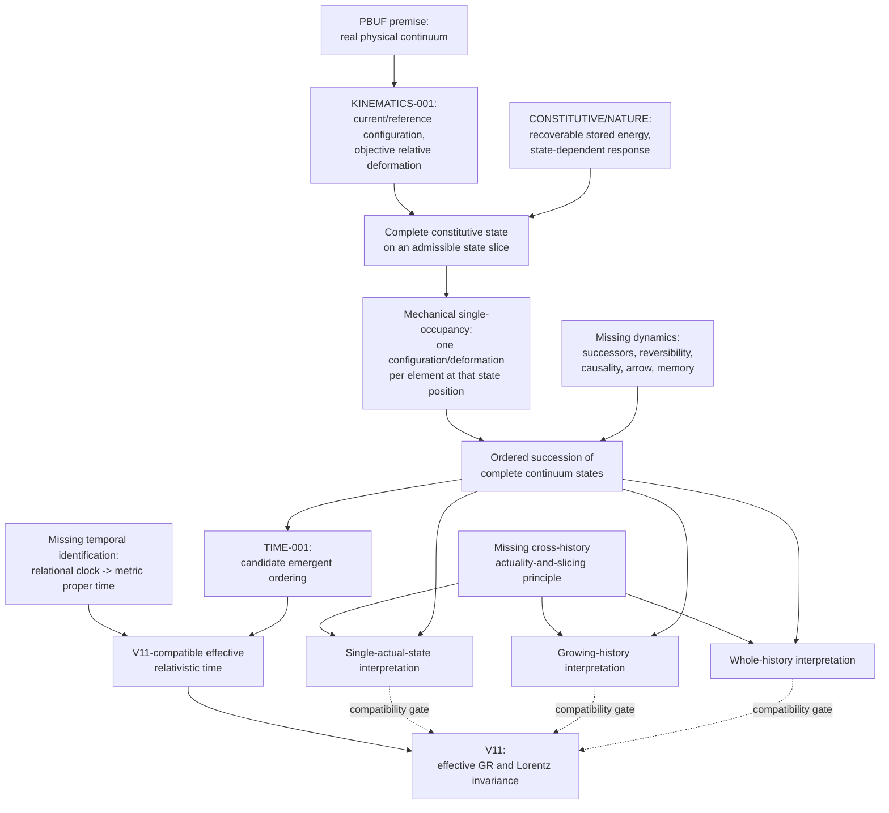

# CONTINUUM-STATE-001 dependency graph

Mechanical single-occupancy constrains every actuality branch: no branch permits two incompatible complete deformations of one element on the same state slice. The branch point occurs only at cross-history actuality, where continuum mechanics supplies no selection rule. Dashed arrows are required V11 compatibility tests, not derived identities.

