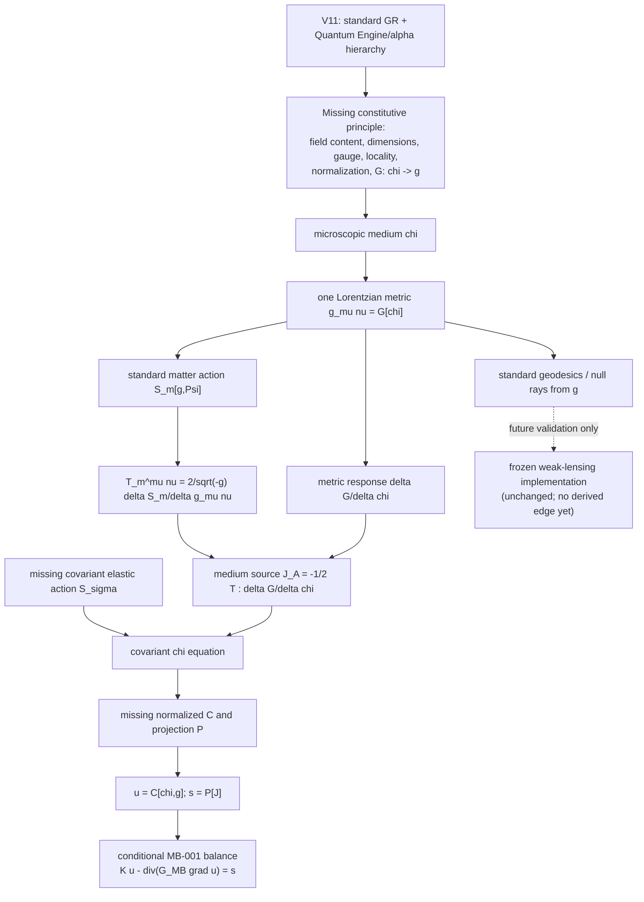

# GEOMETRY-001 derived dependency graph

Solid arrows are authoritative identities, necessary dependencies, or exact conditional derivations. The dashed arrow is deliberately not an implementation authorization. V11 provides the background elastic history but supplies no documented edge from an alpha quantity to `chi`, `G`, `S_sigma`, `C`, or `P`.
