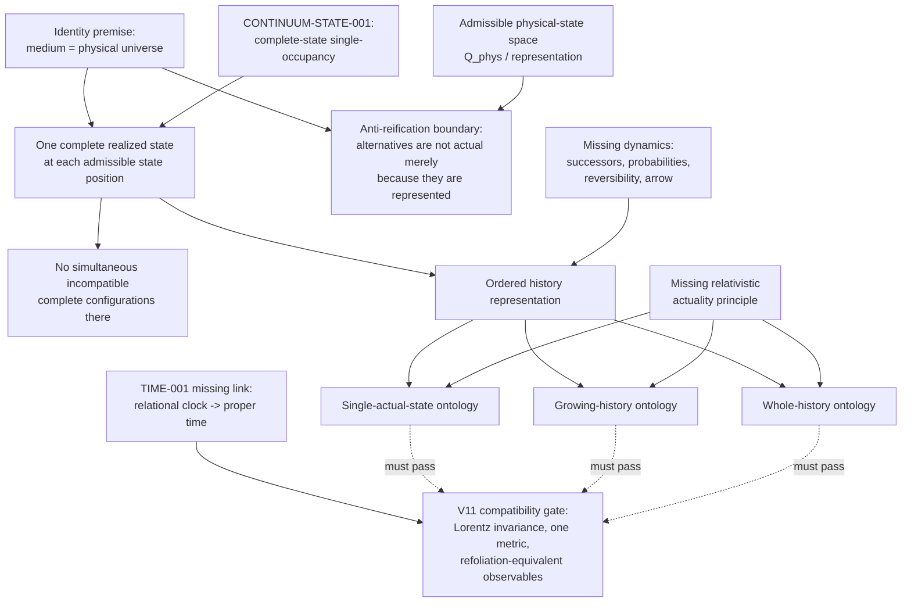

# IDENTITY-001 state-realization dependency graph

Solid arrows indicate logical dependence or required input. Dashed arrows are compatibility tests, not derivations. Identity and continuum mechanics converge on same-position realization uniqueness. The graph branches only when actuality is assigned across an ordered history.

