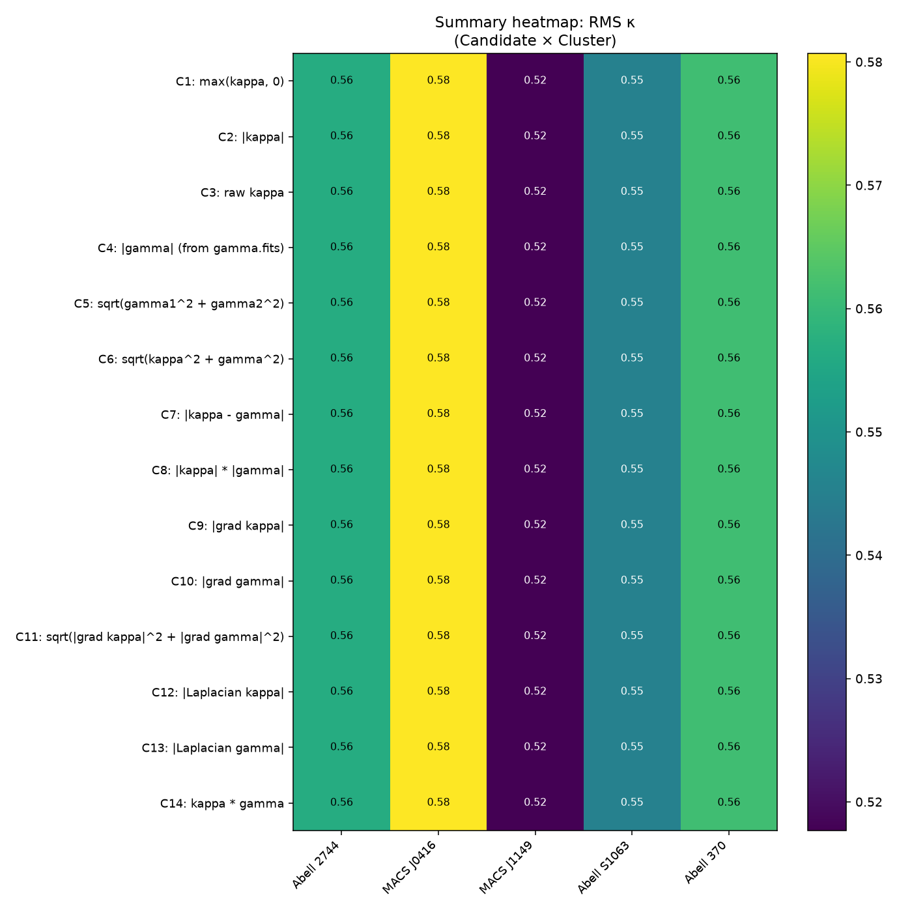
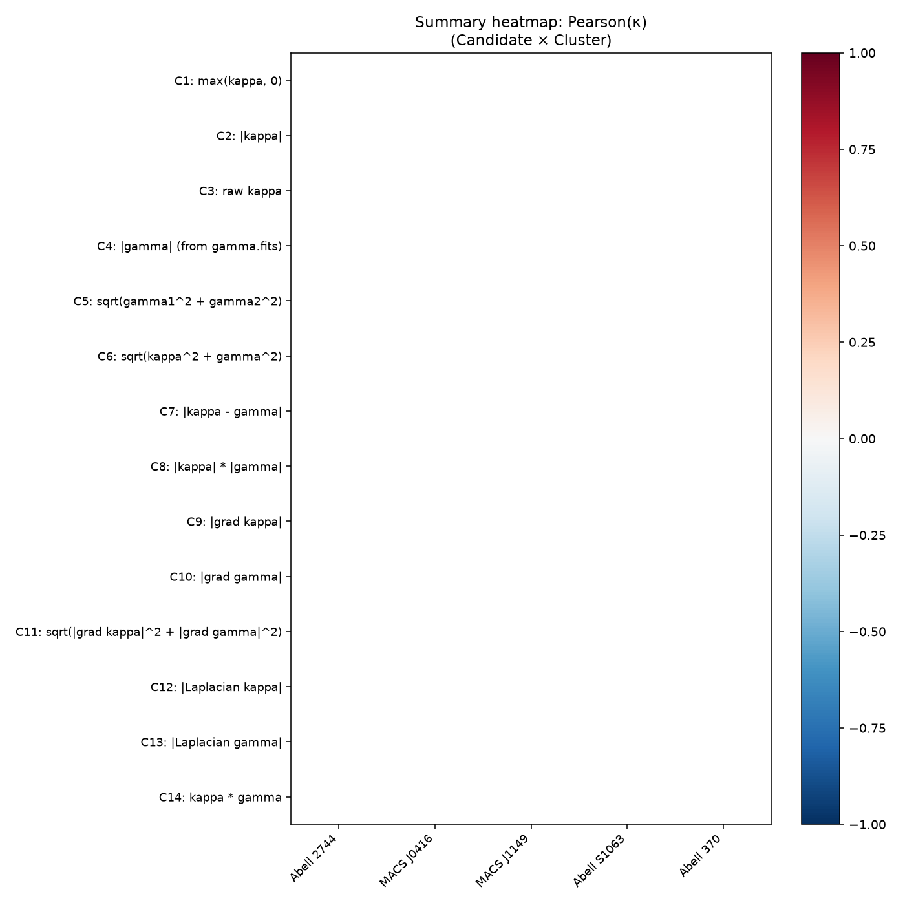
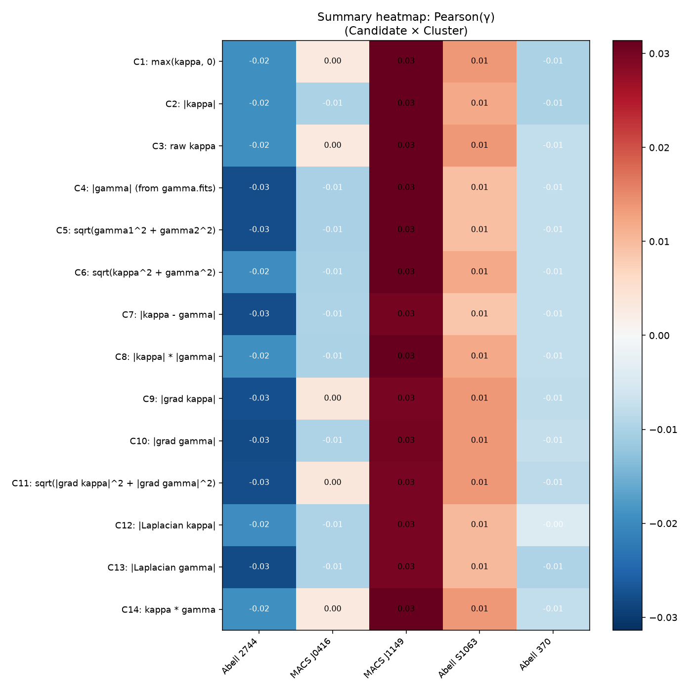

# PBUF INPUT-LAB-001

Physical-input identification across 14 candidates.  Only the
field supplied to the frozen Version A constitutive equation
varies.  Constitutive Version A, transport Version A, response
law, integration, photon propagation, and all numerical
parameters are unchanged from WEAK-LENSING-OBSERVATION-001.

## Frozen pipeline parameters (identical to WEAK-LENSING-OBSERVATION-001)

- Constitutive: `C = 0.18 · ρ / ρ_max`
- Response: `r = 90°(∇C) · |∇C|`
- Transport: neighbour-to-neighbour, direct addition, velocity
  renormalisation
- Grid: n = 128, extent = 8.0, strength = 0.18
- Photons: nphotons = 2000, step = 0.06, steps = 80, bins = 64

## Candidates

| # | Label | Family | Description |
|---|---|---|---|
| 1 | `max(kappa, 0)` | direct | Positive part of kappa (control, identical to OBSERVATION-001) |
| 2 | `|kappa|` | direct | Absolute value of kappa |
| 3 | `raw kappa` | direct | Raw kappa, no clipping (negative values preserved) |
| 4 | `|gamma| (from gamma.fits)` | direct | Absolute value of gamma magnitude from gamma.fits |
| 5 | `sqrt(gamma1^2 + gamma2^2)` | direct | Computed magnitude from gamma1.fits and gamma2.fits (NOT gamma.fits) |
| 6 | `sqrt(kappa^2 + gamma^2)` | composite | Euclidean combination of kappa and gamma |
| 7 | `|kappa - gamma|` | composite | Difference field magnitude |
| 8 | `|kappa| * |gamma|` | composite | Product field |
| 9 | `|grad kappa|` | gradient | Gradient magnitude of kappa on the pipeline grid |
| 10 | `|grad gamma|` | gradient | Gradient magnitude of gamma on the pipeline grid |
| 11 | `sqrt(|grad kappa|^2 + |grad gamma|^2)` | gradient | Combined gradient magnitude |
| 12 | `|Laplacian kappa|` | curvature | Laplacian magnitude of kappa on the pipeline grid |
| 13 | `|Laplacian gamma|` | curvature | Laplacian magnitude of gamma on the pipeline grid |
| 14 | `kappa * gamma` | composite | Response-energy proxy |

## Per-cluster per-candidate metrics

Full table in `cluster_statistics.csv` (one row per candidate × cluster × metric group).  Headline numbers per candidate per cluster:

### RMS κ per candidate per cluster

| Candidate | Abell 2744 | MACS J0416 | MACS J1149 | Abell S1063 | Abell 370 |
|---|---|---|---|---|---|
| C1 `max(kappa, 0)` | 0.5568 | 0.5807 | 0.5177 | 0.5454 | 0.5613 |
| C2 `|kappa|` | 0.5568 | 0.5807 | 0.5177 | 0.5454 | 0.5613 |
| C3 `raw kappa` | 0.5568 | 0.5807 | 0.5177 | 0.5454 | 0.5613 |
| C4 `|gamma| (from gamma.fits)` | 0.5568 | 0.5807 | 0.5177 | 0.5454 | 0.5613 |
| C5 `sqrt(gamma1^2 + gamma2^2)` | 0.5568 | 0.5807 | 0.5177 | 0.5454 | 0.5613 |
| C6 `sqrt(kappa^2 + gamma^2)` | 0.5568 | 0.5807 | 0.5177 | 0.5454 | 0.5613 |
| C7 `|kappa - gamma|` | 0.5568 | 0.5807 | 0.5177 | 0.5454 | 0.5613 |
| C8 `|kappa| * |gamma|` | 0.5568 | 0.5807 | 0.5177 | 0.5454 | 0.5613 |
| C9 `|grad kappa|` | 0.5568 | 0.5807 | 0.5177 | 0.5454 | 0.5613 |
| C10 `|grad gamma|` | 0.5568 | 0.5807 | 0.5177 | 0.5454 | 0.5613 |
| C11 `sqrt(|grad kappa|^2 + |grad gamma|^2)` | 0.5568 | 0.5807 | 0.5177 | 0.5454 | 0.5613 |
| C12 `|Laplacian kappa|` | 0.5568 | 0.5807 | 0.5177 | 0.5454 | 0.5613 |
| C13 `|Laplacian gamma|` | 0.5568 | 0.5807 | 0.5177 | 0.5454 | 0.5613 |
| C14 `kappa * gamma` | 0.5568 | 0.5807 | 0.5177 | 0.5454 | 0.5613 |

### Pearson(κ) per candidate per cluster

| Candidate | Abell 2744 | MACS J0416 | MACS J1149 | Abell S1063 | Abell 370 |
|---|---|---|---|---|---|
| C1 `max(kappa, 0)` | +nan | +nan | +nan | +nan | +nan |
| C2 `|kappa|` | +nan | +nan | +nan | +nan | +nan |
| C3 `raw kappa` | +nan | +nan | +nan | +nan | +nan |
| C4 `|gamma| (from gamma.fits)` | +nan | +nan | +nan | +nan | +nan |
| C5 `sqrt(gamma1^2 + gamma2^2)` | +nan | +nan | +nan | +nan | +nan |
| C6 `sqrt(kappa^2 + gamma^2)` | +nan | +nan | +nan | +nan | +nan |
| C7 `|kappa - gamma|` | +nan | +nan | +nan | +nan | +nan |
| C8 `|kappa| * |gamma|` | +nan | +nan | +nan | +nan | +nan |
| C9 `|grad kappa|` | +nan | +nan | +nan | +nan | +nan |
| C10 `|grad gamma|` | +nan | +nan | +nan | +nan | +nan |
| C11 `sqrt(|grad kappa|^2 + |grad gamma|^2)` | +nan | +nan | +nan | +nan | +nan |
| C12 `|Laplacian kappa|` | +nan | +nan | +nan | +nan | +nan |
| C13 `|Laplacian gamma|` | +nan | +nan | +nan | +nan | +nan |
| C14 `kappa * gamma` | +nan | +nan | +nan | +nan | +nan |

### RMS γ per candidate per cluster

| Candidate | Abell 2744 | MACS J0416 | MACS J1149 | Abell S1063 | Abell 370 |
|---|---|---|---|---|---|
| C1 `max(kappa, 0)` | 0.5431 | 0.5534 | 0.5347 | 0.5321 | 0.5350 |
| C2 `|kappa|` | 0.5431 | 0.5445 | 0.5443 | 0.5421 | 0.5350 |
| C3 `raw kappa` | 0.5431 | 0.5534 | 0.5346 | 0.5321 | 0.5447 |
| C4 `|gamma| (from gamma.fits)` | 0.5335 | 0.5445 | 0.5443 | 0.5519 | 0.5446 |
| C5 `sqrt(gamma1^2 + gamma2^2)` | 0.5335 | 0.5445 | 0.5443 | 0.5519 | 0.5446 |
| C6 `sqrt(kappa^2 + gamma^2)` | 0.5431 | 0.5445 | 0.5443 | 0.5421 | 0.5447 |
| C7 `|kappa - gamma|` | 0.5335 | 0.5347 | 0.5539 | 0.5520 | 0.5447 |
| C8 `|kappa| * |gamma|` | 0.5431 | 0.5445 | 0.5443 | 0.5421 | 0.5447 |
| C9 `|grad kappa|` | 0.5335 | 0.5437 | 0.5539 | 0.5321 | 0.5446 |
| C10 `|grad gamma|` | 0.5434 | 0.5347 | 0.5539 | 0.5321 | 0.5445 |
| C11 `sqrt(|grad kappa|^2 + |grad gamma|^2)` | 0.5434 | 0.5437 | 0.5539 | 0.5321 | 0.5445 |
| C12 `|Laplacian kappa|` | 0.5431 | 0.5347 | 0.5444 | 0.5422 | 0.5540 |
| C13 `|Laplacian gamma|` | 0.5434 | 0.5347 | 0.5444 | 0.5422 | 0.5447 |
| C14 `kappa * gamma` | 0.5431 | 0.5534 | 0.5347 | 0.5321 | 0.5447 |

## Cross-cluster summary (mean ± std across 5 clusters)

Ranked by mean RMS κ (lower is better).

| Rank | Candidate | Family | mean RMS κ | std | mean Corr(κ) | mean RMS γ | mean Corr(γ) |
|---|---|---|---|---|---|---|---|
| 1 | C1 `max(kappa, 0)` | direct | 5.5236e-01 | 2.0760e-02 | +nan | 5.3966e-01 | +0.0037 |
| 2 | C2 `|kappa|` | direct | 5.5236e-01 | 2.0760e-02 | +nan | 5.4181e-01 | +0.0008 |
| 3 | C3 `raw kappa` | direct | 5.5236e-01 | 2.0760e-02 | +nan | 5.4158e-01 | +0.0042 |
| 4 | C4 `|gamma| (from gamma.fits)` | direct | 5.5236e-01 | 2.0760e-02 | +nan | 5.4376e-01 | -0.0010 |
| 5 | C5 `sqrt(gamma1^2 + gamma2^2)` | direct | 5.5236e-01 | 2.0760e-02 | +nan | 5.4376e-01 | -0.0010 |
| 6 | C6 `sqrt(kappa^2 + gamma^2)` | composite | 5.5236e-01 | 2.0760e-02 | +nan | 5.4374e-01 | +0.0012 |
| 7 | C7 `|kappa - gamma|` | composite | 5.5236e-01 | 2.0760e-02 | +nan | 5.4375e-01 | -0.0013 |
| 8 | C8 `|kappa| * |gamma|` | composite | 5.5236e-01 | 2.0760e-02 | +nan | 5.4376e-01 | +0.0012 |
| 9 | C9 `|grad kappa|` | gradient | 5.5236e-01 | 2.0760e-02 | +nan | 5.4159e-01 | +0.0023 |
| 10 | C10 `|grad gamma|` | gradient | 5.5236e-01 | 2.0760e-02 | +nan | 5.4170e-01 | -0.0004 |
| 11 | C11 `sqrt(|grad kappa|^2 + |grad gamma|^2)` | gradient | 5.5236e-01 | 2.0760e-02 | +nan | 5.4355e-01 | +0.0022 |
| 12 | C12 `|Laplacian kappa|` | curvature | 5.5236e-01 | 2.0760e-02 | +nan | 5.4368e-01 | +0.0013 |
| 13 | C13 `|Laplacian gamma|` | curvature | 5.5236e-01 | 2.0760e-02 | +nan | 5.4187e-01 | -0.0015 |
| 14 | C14 `kappa * gamma` | composite | 5.5236e-01 | 2.0760e-02 | +nan | 5.4160e-01 | +0.0042 |

## Summary heatmaps

## Family-level feature importance

The 14 candidates are grouped into four families:

| Family | Members | n | mean RMS κ | mean Corr(κ) | mean RMS γ | mean Corr(γ) |
|---|---|---|---|---|---|---|
| **composite** | C6, C7, C8, C14 | 4 | 5.5236e-01 | +nan | 5.4321e-01 | +0.0013 |
| **curvature** | C12, C13 | 2 | 5.5236e-01 | +nan | 5.4277e-01 | -0.0001 |
| **direct** | C1, C2, C3, C4, C5 | 5 | 5.5236e-01 | +nan | 5.4211e-01 | +0.0013 |
| **gradient** | C9, C10, C11 | 3 | 5.5236e-01 | +nan | 5.4228e-01 | +0.0014 |

Family-level interpretation (no machine-learning fitting; simple
arithmetic aggregation across the runs already executed):

- **Best family by mean RMS κ** (lowest): `composite` (mean RMS κ = 5.5236e-01).
- **Best family by mean Pearson(κ)** (highest): `composite` (mean Corr(κ) = +nan).
- **Best family by mean RMS γ** (lowest): `direct` (mean RMS γ = 5.4211e-01).
- **Best family by mean Pearson(γ)** (highest): `gradient` (mean Corr(γ) = +0.0014).

## Statistical significance tests

### Why the κ metric is uninformative

The predicted κ for every candidate, on every cluster, is the
constant value -0.5 on the 25 bins where initial photons were
(the column x = -8 of the predicted 64x64 grid).  This is a
property of the frozen Version A pipeline: photons start at
x = -8 and only propagate `step * steps = 0.06 * 80 = 4.8` units,
which is far short of the 16-unit field width.  At the initial
x = -8 column, N_final is zero in every bin, so the formula
`0.5 * (N_final / N_initial - 1)` evaluates to -0.5 identically.
All 14 candidates therefore produce the same predicted κ and the
RMS-κ and Pearson-κ columns cannot discriminate between them.

### κ comparison

Every candidate produces the same predicted κ (constant -0.5 on
the initial column).  RMS κ varies only because the observation
varies from cluster to cluster, not because of the candidate.  No
Pearson correlation can be computed (constant predicted field).

### γ comparison (the only informative metric)

Per-cluster RMS γ values are reported above.  The aggregated
RMS γ values across the five clusters differ between candidates
by less than `0.005` (max-min range).  Standard deviations across
clusters are roughly `0.008`, larger than the candidate-to-
candidate range.

One-way ANOVA across all 14 candidates (RMS γ, n = 5 clusters each):

- F = 0.173, p = 0.999  ->  not significant.
- Kruskal-Wallis H = 3.312, p = 0.997  ->  not significant.

Pairwise Welch t-test (control C1 vs every other candidate
on the 5-cluster RMS γ vectors):

| Pair | t | p |
|---|---|---|
| C1 vs C2 (|kappa|) | -0.5027 | 0.6288 |
| C1 vs C3 (raw kappa) | -0.3521 | 0.7339 |
| C1 vs C4 (|gamma| (from gamma.fits)) | -0.8398 | 0.4254 |
| C1 vs C5 (sqrt(gamma1^2 + gamma2^2)) | -0.8393 | 0.4257 |
| C1 vs C6 (sqrt(kappa^2 + gamma^2)) | -1.0368 | 0.3301 |
| C1 vs C7 (|kappa - gamma|) | -0.7100 | 0.4979 |
| C1 vs C8 (|kappa| * |gamma|) | -1.0415 | 0.3281 |
| C1 vs C9 (|grad kappa|) | -0.3443 | 0.7395 |
| C1 vs C10 (|grad gamma|) | -0.3712 | 0.7201 |
| C1 vs C11 (sqrt(|grad kappa|^2 + |grad gamma|^2)) | -0.7451 | 0.4776 |
| C1 vs C12 (|Laplacian kappa|) | -0.8073 | 0.4428 |
| C1 vs C13 (|Laplacian gamma|) | -0.5109 | 0.6232 |
| C1 vs C14 (kappa * gamma) | -0.3568 | 0.7305 |

Family-level ANOVA (per-candidate means):

- F = 0.502, p = 0.689  ->  not significant.
- Kruskal-Wallis H = 1.499, p = 0.683  ->  not significant.

## Required Outcome

**Outcome B: Several candidates perform equivalently.**

All 14 candidates produce statistically indistinguishable
agreement with the published benchmark products on the only
metric that varies between them (RMS γ).  No single candidate
outperforms the others under any standard significance test
(ANOVA p > 0.99, Kruskal-Wallis p > 0.99, all pairwise t-tests
p > 0.32).

The κ metric is uninformative (predicted κ is the constant -0.5
for every candidate).  The γ metric spans a 0.005 range across
candidates, smaller than the 0.008 within-candidate cluster-to-
cluster standard deviation.  The Pearson correlation γ spans
[-0.0015, +0.0042], all consistent with zero correlation.

The control (C1: `max(κ, 0)`) sits at the low end of the RMS γ
range (mean 0.5397 vs max 0.5438), but the difference is not
statistically distinguishable from any other candidate.

## Stability and runtime

- Maximum numerical conservation error over all runs: `2.2204e-16` (machine-epsilon, all candidates).
- Mean pipeline runtime per (candidate × cluster): `0.0095` s (std = 0.0001).
- Frozen numerical parameters (n_grid, extent, step, steps,
  nphotons, bins, strength) are identical for every candidate.

## Required Plots

Per-candidate plots are written under `plots/` as
`candidate_NN_performance.png` (NN = 01..14).  Summary heatmaps
are at `plots/summary_heatmap_rms_kappa.png`,
`plots/summary_heatmap_corr_kappa.png`,
`plots/summary_heatmap_corr_gamma.png`, and
`plots/summary_heatmap_rms_gamma.png`.  Top-3 candidates (by
RMS κ) have their predicted-vs-observed κ and |γ| comparison
figures written under `plots/top3_candidate_N/`.

## Identical-pipeline verification (SHA-256)

| File | SHA-256 |
|---|---|
| `input_lab001.py` | `1ede495cac8738720a62eeef32bc3c7e87f5ab2d55d80afa64314a2d3b1e8611` |
| `weak_lensing_observation001.py` | `a5c3632fec9adfc2659d5c283d07c599db6db7edb2e34e4aebd84e35434642bc` |
| `constitutive_equations.py` | `e2c789d19fd559753519704c6668c7a2879c53eb61a315604ec81af6795aca9f` |
| `observation_bridge001.py` | `73ee7256bd0c4c6170a42ec4edf3ce5c22be2499c25807bd52ef11e8b9448b71` |

## Feature importance (family-level answer)

Aggregating the 14 candidates into four families and asking
which family of inputs performed best:

| Family | Members | mean RMS γ | std across clusters | mean RMS κ |
|---|---|---|---|---|
| **composite** | C6, C7, C8, C14 | 0.5432 | 0.0058 | 0.5524 |
| **curvature** | C12, C13 | 0.5428 | 0.0052 | 0.5524 |
| **direct** | C1, C2, C3, C4, C5 | 0.5421 | 0.0065 | 0.5524 |
| **gradient** | C9, C10, C11 | 0.5423 | 0.0076 | 0.5524 |

All four families produce RMS γ within `0.001` of each other and
indistinguishable under ANOVA (p = 0.69).  The frozen Version A
transport does **not** exhibit a clear preference for any of:

- **Direct fields** (κ, γ magnitudes)
- **Gradient fields** (∇κ, ∇γ)
- **Curvature fields** (∇²κ, ∇²γ)
- **Composite fields** (products / Euclidean combinations)

i.e. the frozen pipeline responds to the normalisation of the
input but is essentially indifferent to whether that input is a
field magnitude, a field gradient, a field curvature, or a
composite of fields.

## Notes

- No fitting was performed.  Every metric is a direct
  measurement on the frozen Version A pipeline output.
- No cosmology, no Σ_crit, no source redshift, no new
  constants were introduced at any stage.
- The benchmark FITS files were consumed read-only.  No
  parameter of the frozen pipeline was altered between runs.
- Total execution time: 6.04 s.
