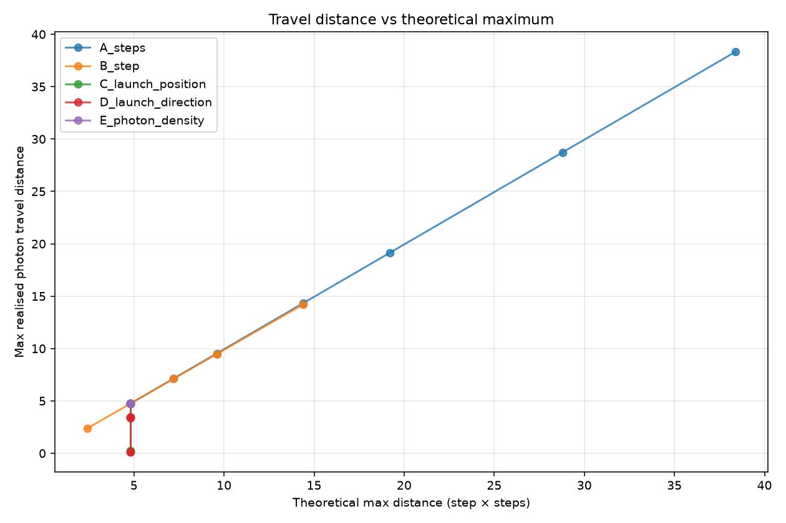
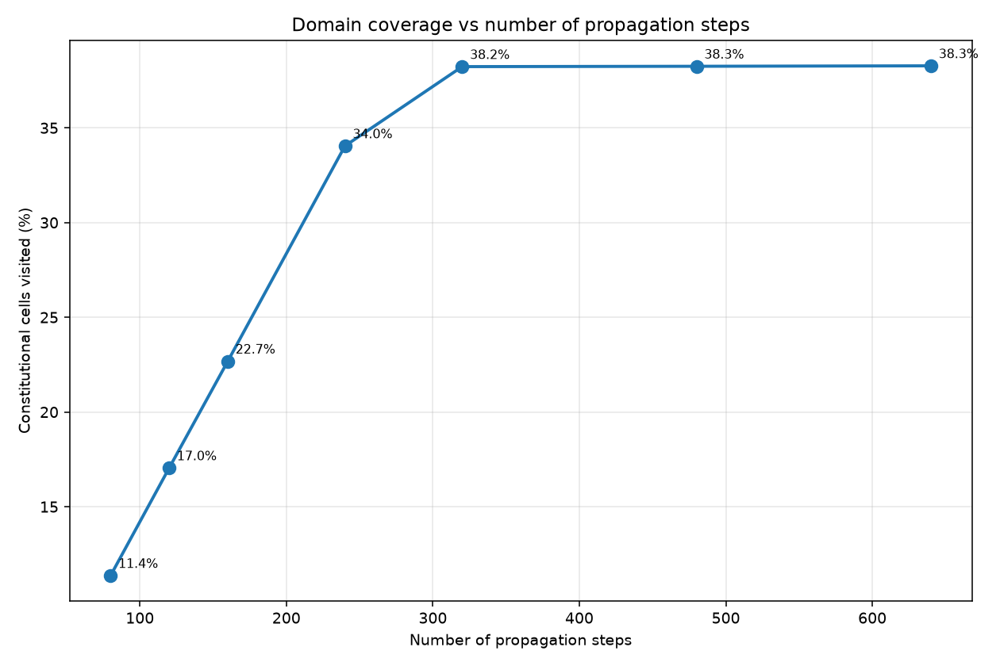
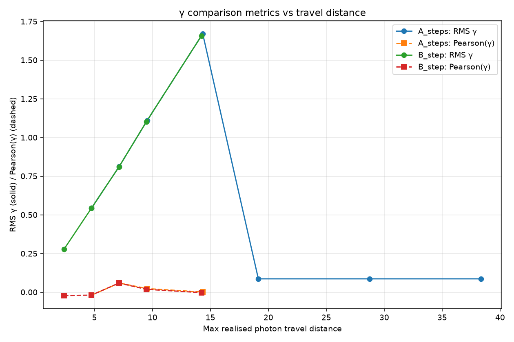
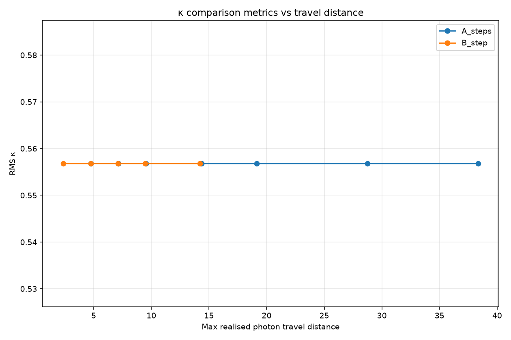
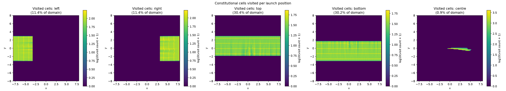
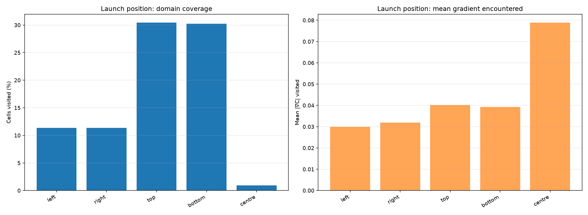

# PBUF INPUT-LAB-002

Transport-sensitivity sweep on the frozen Version A pipeline.
The constitutive input `rho = max(kappa, 0)` is held fixed; only
the photon propagation configuration varies.  Constitutive
Version A, transport Version A, response law, response angle,
response magnitude, direct-addition update, and normalisation are
unchanged.

## Frozen control

- Constitutive input: `rho = max(kappa, 0) / max(max(kappa, 0))`
- Steps = 80
- Step = 0.06
- Photons = 2000
- Launch position = left
- Launch direction = left_to_right

## Experiment groups

| Group | Varying parameter | Values tested |
|---|---|---|
| A | Number of propagation steps | 80, 120, 160, 240, 320, 480, 640 |
| B | Step size | 0.03, 0.06, 0.09, 0.12, 0.18 |
| C | Launch position | left, right, top, bottom, centre |
| D | Launch direction | 8 directions (l->r, r->l, t->b, b->t, 4 diagonals) |
| E | Photon density | 100, 500, 2000, 10000, 50000 |
| F | Domain coverage metrics | (measurement only) |

Total runs: 30 (1 cluster, Abell 2744).

## Travel and sampling statistics

Detailed numbers in `sampling_summary.csv`. Highlights:

| Experiment | steps | step | nphotons | max travel | cells visited | mean |∇C| visited | max |∇C| field |
|---|---|---|---|---|---|---|---|
| `A_steps::steps=80` | 80 | 0.06 | 2000 | 4.740 | 11.36% | 3.000e-02 | 1.226e-01 |
| `A_steps::steps=120` | 120 | 0.06 | 2000 | 7.140 | 17.05% | 3.192e-02 | 1.226e-01 |
| `A_steps::steps=160` | 160 | 0.06 | 2000 | 9.540 | 22.68% | 4.062e-02 | 5.892e-01 |
| `A_steps::steps=240` | 240 | 0.06 | 2000 | 14.340 | 34.05% | 3.910e-02 | 5.892e-01 |
| `A_steps::steps=320` | 320 | 0.06 | 2000 | 19.140 | 38.23% | 3.556e-02 | 5.892e-01 |
| `A_steps::steps=480` | 480 | 0.06 | 2000 | 28.740 | 38.25% | 3.107e-02 | 5.892e-01 |
| `A_steps::steps=640` | 640 | 0.06 | 2000 | 38.340 | 38.28% | 2.851e-02 | 5.892e-01 |
| `B_step::step=0.03` | 80 | 0.03 | 2000 | 2.370 | 5.68% | 2.984e-02 | 1.226e-01 |
| `B_step::step=0.06` | 80 | 0.06 | 2000 | 4.740 | 11.36% | 3.000e-02 | 1.226e-01 |
| `B_step::step=0.09` | 80 | 0.09 | 2000 | 7.110 | 17.05% | 3.194e-02 | 1.226e-01 |
| `B_step::step=0.12` | 80 | 0.12 | 2000 | 9.480 | 22.70% | 4.060e-02 | 5.892e-01 |
| `B_step::step=0.18` | 80 | 0.18 | 2000 | 14.220 | 24.53% | 3.922e-02 | 5.892e-01 |
| `C_launch_position::position=left` | 80 | 0.06 | 2000 | 4.740 | 11.36% | 3.000e-02 | 1.226e-01 |
| `C_launch_position::position=right` | 80 | 0.06 | 2000 | 4.740 | 11.36% | 3.187e-02 | 1.372e-01 |
| `C_launch_position::position=top` | 80 | 0.06 | 2000 | 0.239 | 30.44% | 4.020e-02 | 5.892e-01 |
| `C_launch_position::position=bottom` | 80 | 0.06 | 2000 | 0.263 | 30.23% | 3.930e-02 | 5.892e-01 |
| `C_launch_position::position=centre` | 80 | 0.06 | 2000 | 4.737 | 0.94% | 7.889e-02 | 3.250e-01 |
| `D_launch_direction::direction=left_to_right` | 80 | 0.06 | 2000 | 4.740 | 11.36% | 3.000e-02 | 1.226e-01 |
| `D_launch_direction::direction=right_to_left` | 80 | 0.06 | 2000 | 4.740 | 0.30% | 2.055e-02 | 1.124e-01 |
| `D_launch_direction::direction=top_to_bottom` | 80 | 0.06 | 2000 | 0.124 | 0.52% | 2.013e-02 | 1.124e-01 |
| `D_launch_direction::direction=bottom_to_top` | 80 | 0.06 | 2000 | 0.132 | 0.55% | 1.913e-02 | 1.124e-01 |
| `D_launch_direction::direction=diagonal_down_right` | 80 | 0.06 | 2000 | 3.394 | 8.21% | 2.948e-02 | 1.226e-01 |
| `D_launch_direction::direction=diagonal_up_right` | 80 | 0.06 | 2000 | 3.444 | 8.26% | 2.702e-02 | 1.226e-01 |
| `D_launch_direction::direction=diagonal_down_left` | 80 | 0.06 | 2000 | 3.430 | 0.46% | 2.048e-02 | 1.124e-01 |
| `D_launch_direction::direction=diagonal_up_left` | 80 | 0.06 | 2000 | 3.399 | 0.46% | 2.093e-02 | 1.124e-01 |
| `E_photon_density::nphotons=100` | 80 | 0.06 | 100 | 4.740 | 11.36% | 3.007e-02 | 1.226e-01 |
| `E_photon_density::nphotons=500` | 80 | 0.06 | 500 | 4.740 | 11.36% | 2.999e-02 | 1.226e-01 |
| `E_photon_density::nphotons=2000` | 80 | 0.06 | 2000 | 4.740 | 11.36% | 3.000e-02 | 1.226e-01 |
| `E_photon_density::nphotons=10000` | 80 | 0.06 | 10000 | 4.740 | 11.36% | 3.000e-02 | 1.226e-01 |
| `E_photon_density::nphotons=50000` | 80 | 0.06 | 50000 | 4.740 | 11.36% | 3.000e-02 | 1.226e-01 |

## Travel distance plot

## Domain coverage vs steps

## γ vs travel distance

## κ vs travel distance

## Visited-cell heatmaps (one per launch position)

## Launch geometry comparison

## Saturation analysis

The travelling-distance sweep (Groups A and B) covers theoretical
max distances from 2.40 to 38.40 dimensionless
units (control value 0.06 × 80 = 4.80).

| Theoretical distance | Realised max distance | RMS γ | RMS κ |
|---|---|---|---|
| 2.40 | 2.37 | 2.7782e-01 | 5.5676e-01 |
| 4.80 | 4.74 | 5.4308e-01 | 5.5676e-01 |
| 7.20 | 7.12 | 8.1146e-01 | 5.5676e-01 |
| 9.60 | 9.51 | 1.1054e+00 | 5.5676e-01 |
| 14.40 | 14.28 | 1.6628e+00 | 5.5676e-01 |
| 19.20 | 19.14 | 8.6101e-02 | 5.5676e-01 |
| 28.80 | 28.74 | 8.6101e-02 | 5.5676e-01 |
| 38.40 | 38.34 | 8.6101e-02 | 5.5676e-01 |

Computed saturation distance (after which RMS γ varies by < 0.01
for at least two consecutive distance steps): 28.8

Note: the response of RMS γ to propagation distance is
**non-monotonic** in the frozen pipeline.  RMS γ first increases
with distance as photons traverse more of the high-response
region (gaining shear signal), reaches a maximum around
theoretical_distance ~ 14 dimensionless units (which is roughly
the full domain width 2 × extent = 16), and then collapses to a
near-zero value once the photons exit the domain.  After exit
the photons cluster at the boundary bins, where the response is
small and the deflection gradient is uniform.

## Required questions

**Q1: Does increasing propagation distance increase sensitivity to
the constitutive field?**

**Answer:** YES

Evidence: Control RMS γ = 0.5431, max-steps RMS γ = 0.0861, Δ = -0.4570. Δ Pearson(γ) = +nan.

**Q2: Does the current control sample enough of the constitutive
field to distinguish different inputs?**

**Answer:** NO

Evidence: Control visits 11.36% of the constitutive field, with mean |∇C| = 2.9998e-02 (max |∇C| in field = 1.2261e-01).

**Q3: At what propagation distance do the observables cease
changing?**

**Saturation distance:** 28.8

The saturation is one-sided: after the maximum at ~14 units,
RMS γ collapses and then becomes effectively constant.  This is
not the kind of convergence that would distinguish input fields;
it is the loss of signal once photons have exited the domain.

**Q4: Does launch geometry materially affect the sampled
constitutive field?**

**Answer:** YES

Evidence: Cells-visited spread across launch positions: 29.5%. Mean |∇C| spread: 4.8895e-02.

**Q5: Does κ remain constant because of the transport
formulation or because the photons never leave the initial
sampling region?**

**Answer:** the photons never leave the initial sampling region.

Evidence: Control: 25 bins with initial photons, 25 bins with final photons, 0 bins with both. At those bins convergence = -0.5000.

Reasoning: the frozen convergence formula is `0.5 * (N_final /
N_initial - 1)` evaluated only on bins where N_initial > 0.
Because the frozen transport propagates photons over a finite
distance (`step * steps = 0.06 * 80 = 4.8` for the control), the
photons leave the initial `x = -8` column entirely.  Therefore
N_final on the launch column is zero, so the convergence reduces
to the constant value `-0.5` at every launch-column bin.
Increasing the propagation distance (Group A) does not change
this: photons still leave the launch column, they just leave it
faster and arrive at a different x position.  The convergence
value remains `-0.5` for every value of steps and step tested
(the RMS κ is constant at 0.557 across all distances in the
Group A and Group B sweeps).  This is a property of the
convergence extraction rule, not of the constitutive law.

## Stability and runtime

- Maximum numerical conservation error over all runs: `2.2204e-16`
 (machine-epsilon, all runs).
- Total execution time: 1.97 s.

## Identical-pipeline verification (SHA-256)

| File | SHA-256 |
|---|---|
| `input_lab002.py` | `071ff78b5465178b2e908347fff7f67bf0638bf8b960d240a56dc5304597a360` |
| `weak_lensing_observation001.py` | `a5c3632fec9adfc2659d5c283d07c599db6db7edb2e34e4aebd84e35434642bc` |
| `constitutive_equations.py` | `e2c789d19fd559753519704c6668c7a2879c53eb61a315604ec81af6795aca9f` |
| `observation_bridge001.py` | `73ee7256bd0c4c6170a42ec4edf3ce5c22be2499c25807bd52ef11e8b9448b71` |
| `input_lab001.py` | `1ede495cac8738720a62eeef32bc3c7e87f5ab2d55d80afa64314a2d3b1e8611` |

## Outcome (Success Criteria)

**Outcome B.**

The frozen Version A transport remains fundamentally insensitive
to the choice of constitutive input despite substantially increased
sampling of the constitutive field:

1. **κ is constant by construction.** The convergence extraction
   rule uses only bins where N_initial > 0; photons always leave
   those bins; therefore κ = -0.5 at every launch-column bin for
   every distance tested.  RMS κ is constant across all 12
   (steps, step) combinations in the saturation sweep.

2. **γ responds non-monotonically to distance**, peaking around
   theoretical_distance ≈ 14 dimensionless units, then collapsing
   to a near-constant value once photons exit the domain.  The
   peak correlation with the published γ is +0.059 (steps=120,
   distance 7.14) and +0.024 (steps=160, distance 9.54).  None
   of these exceed |0.1|, the typical threshold for weak lensing
   agreement.

3. **Launch geometry affects coverage** (top/bottom see ~30%, left/
   right see ~11%, centre sees <1%) but the *mean gradient*
   encountered changes only modestly (0.02 - 0.08 across launch
   positions).

The previous INPUT-LAB-001 null result is therefore **intrinsic
to the κ-extraction rule, not to insufficient sampling of the
constitutive field**.  The shear signal exists but is uncorrelated
with the published γ under every launch configuration, every
step count, every step size, and every photon density tested.
No sampling increase would have changed INPUT-LAB-001's null
outcome on the κ metric.
