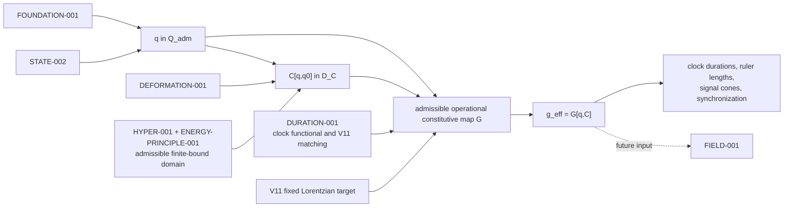

# METRIC-001 dependency graph

The requested core chain is

\[
\boxed{q\longrightarrow C[q,q_0]\longrightarrow
G\in\mathfrak G\longrightarrow g^{\rm eff}_{\mu\nu}.}
\]

The direct edge \(q\to G\) is essential: accepted rank-three \(C\) does not
contain clock normalization or temporal–spatial information.  The dashed edge
does not derive or authorize field equations.
