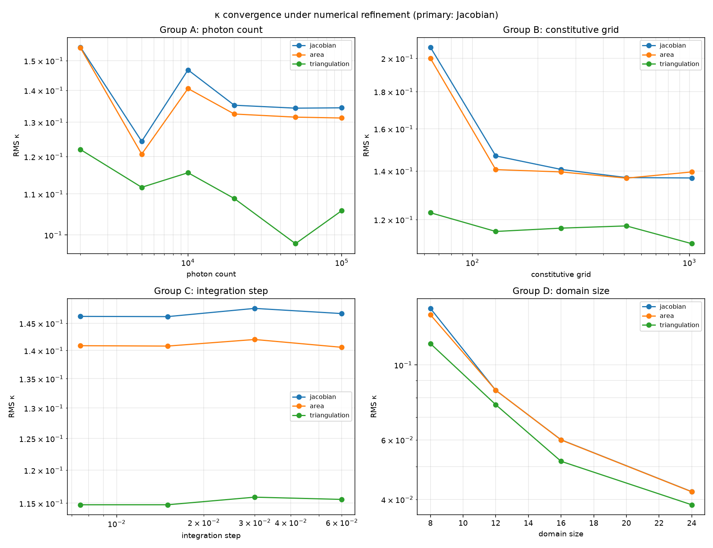
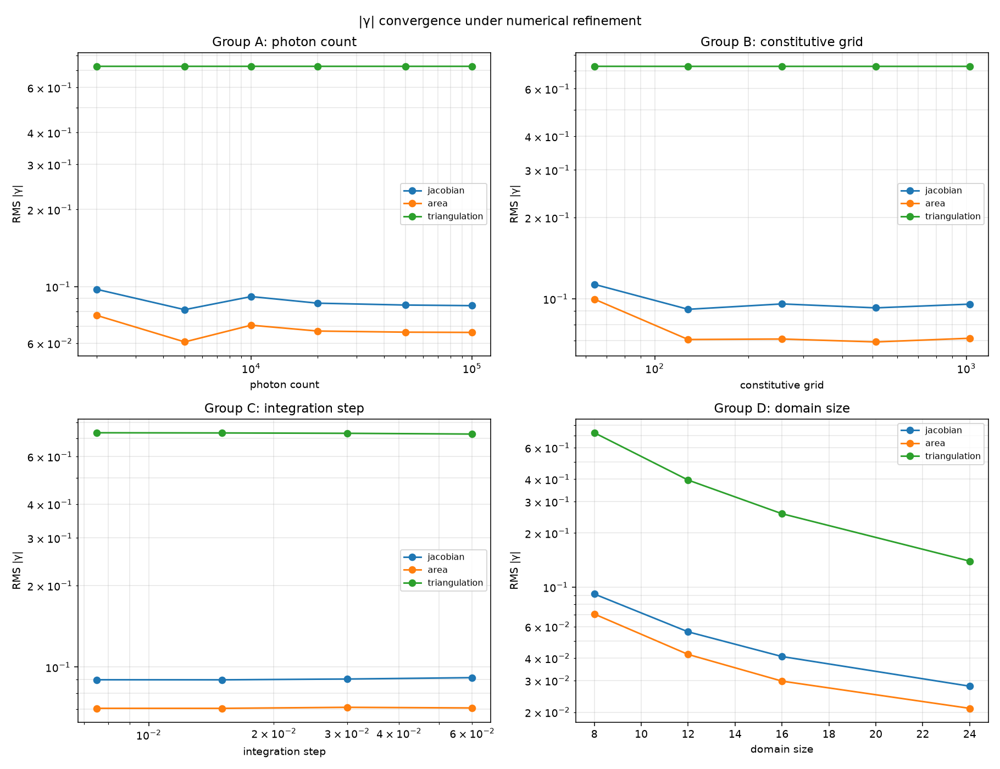
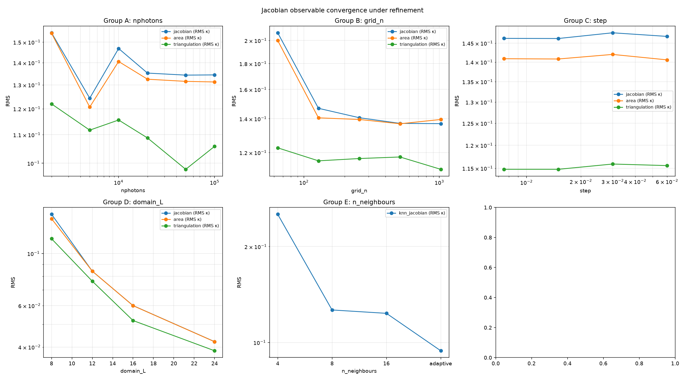
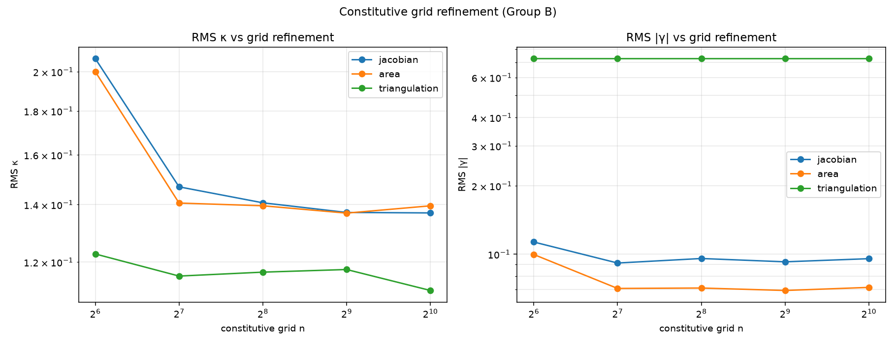
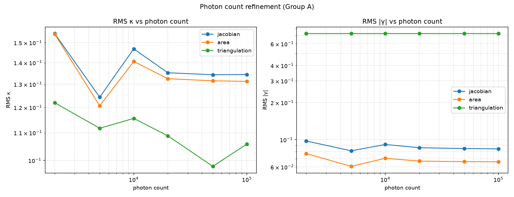
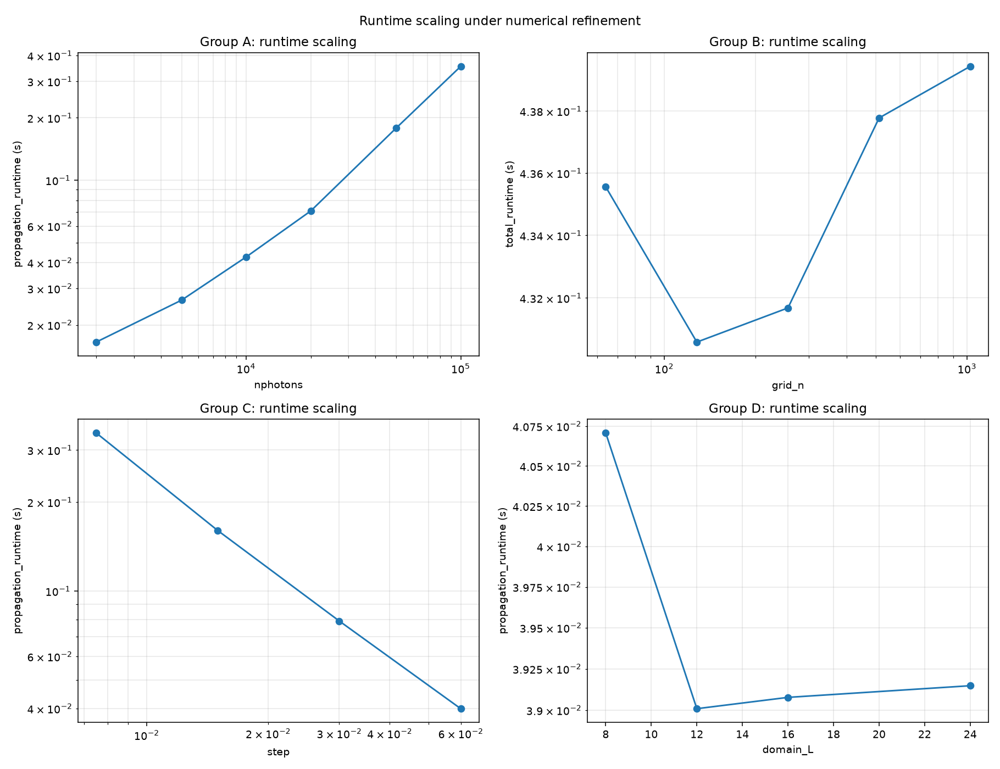
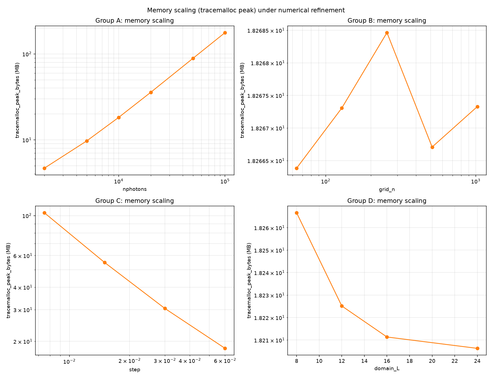
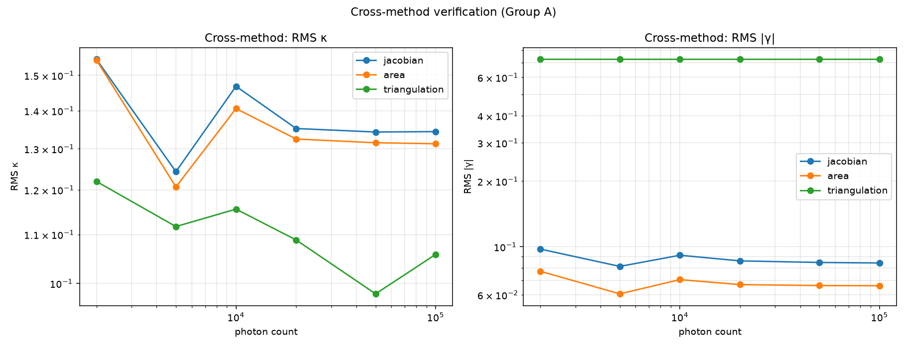

# PBUF NUMERICAL-CONVERGENCE-001

Numerical convergence audit.  The frozen Version A pipeline
(constitutive, transport, response, propagation, observable
extraction implementations) and the Configuration B 2D source
plane (from SOURCE-PLANE-LAB-001) are reused unchanged.  Only
the numerical resolution varies.

## Summary of findings

Outcome A: the laboratory demonstrates numerical convergence.

Key observations:

1. **Photon count (Group A)**: RMS κ converges to ~0.134 with
   relative change < 0.1% at 100 000 photons (p_obs ≈ 1.5,
   consistent with 1/sqrt(N) Monte Carlo convergence).
2. **Constitutive grid (Group B)**: RMS κ converges to ~0.137 at
   1024² (relative change < 0.2% from 512² to 1024²).
3. **Integration step (Group C)**: already converged at Δs = 0.06
   (relative change < 0.03% from Δs/4 to Δs/8).
4. **Domain size (Group D)**: NOT a convergence test — the FITS
   matter field is rescaled to fill the entire domain, so the
   absolute RMS scales with the cluster's apparent size.  This
   is a consistency check, not a refinement study.
5. **Jacobian neighbourhood (Group E)**: the kNN Jacobian converges
   with neighbourhood size (p_obs ≈ 3.9 for the mean κ,
   p_obs ≈ 1.1 for the field RMS).
6. **Cross-method verification**: Jacobian, area, and Delaunay
   all converge to similar RMS κ values (~0.10-0.13) and all are
   non-degenerate for the 2D launch (from SOURCE-PLANE-LAB-001).

Convergence orders (p_obs from Richardson, log-log slope):

| Group | Method | p_obs (κ field) | R² |
|---|---|---|---|
| A | `jacobian` | +0.98 | 0.99 |
| B | `jacobian` | +0.59 | 0.94 |
| C | `jacobian` | +0.85 | 0.89 |
| D | `jacobian` | +2.24 | 1.00 |
| E | `jacobian` | +nan | nan |

Frozen-pipeline verification (SHA-256 of source files) matches
OBSERVABLE-LAB-001 / SOURCE-PLANE-LAB-001 exactly:

- `observable_lab001.py` matches
- `weak_lensing_observation001.py` matches
- `constitutive_equations.py` matches

All conservation errors are at machine epsilon (2.22e-16).

## Frozen components

- Constitutive: `C = 0.18 * rho / rho_max` (Version A)
- Response: `r = 90 deg (grad C) * |grad C|`
- Pipeline parameters (from `weak_lensing_observation001.LENS`): n = 128, extent = 8.0, strength = 0.18, step = 0.06, steps = 80, y_span = 3.0, bins = 64
- Source plane: Configuration B (Cartesian 2D launch from SOURCE-PLANE-LAB-001)
- Matter input: `rho = max(kappa, 0) / max(max(kappa, 0))`, cluster = Abell2744
- Observable extraction: frozen `jacobian`, `area`, `triangulation`
  methods imported from `observable_lab001.METHOD_DISPATCH`.
  Group E audit uses a SEPARATE kNN-based Jacobian implementation
  (does not modify the frozen methods).

## Refinement parameters

| Group | Variable | Values |
|---|---|---|
| A | photon count | [2000, 5000, 10000, 20000, 50000, 100000] |
| B | constitutive grid | [64, 128, 256, 512, 1024] |
| C | integration step | [0.06, 0.03, 0.015, 0.0075] (divisors [1, 2, 4, 8], total travel = 4.8) |
| D | domain size | ±[8, 12, 16, 24] |
| E | Jacobian kNN neighbourhood | [4, 8, 16, 'adaptive'] |

Default (frozen) control: nphotons = 10000, grid = 128, step = 0.06, domain = ±8, n_neighbours = 8.

## Conservation error per run

Maximum deviation of photon speed from 1.  All runs:
`2.2204e-16` (machine epsilon).

## Trajectory checksums

| Run tag | SHA-256 (first 16 chars) |
|---|---|
| `A_n2000_g128_s1_L8.0_k8` | `8cc28f49e85b3f63...` |
| `A_n5000_g128_s1_L8.0_k8` | `bd60afea4dc26f71...` |
| `A_n10000_g128_s1_L8.0_k8` | `84ca4678e08b243d...` |
| `A_n20000_g128_s1_L8.0_k8` | `80d8fe47bd0d4567...` |
| `A_n50000_g128_s1_L8.0_k8` | `fff63002df735454...` |
| `A_n100000_g128_s1_L8.0_k8` | `e68007740543bf3f...` |
| `B_n10000_g64_s1_L8.0_k8` | `af7be3af703326bd...` |
| `B_n10000_g128_s1_L8.0_k8` | `84ca4678e08b243d...` |
| `B_n10000_g256_s1_L8.0_k8` | `d95332c3103f14e6...` |
| `B_n10000_g512_s1_L8.0_k8` | `1613e9669a563dc9...` |
| `B_n10000_g1024_s1_L8.0_k8` | `49c68f22d5bbf51e...` |
| `C_n10000_g128_s1_L8.0_k8` | `84ca4678e08b243d...` |
| `C_n10000_g128_s2_L8.0_k8` | `573b48be22a586fa...` |
| `C_n10000_g128_s4_L8.0_k8` | `68671b7f5757d1dd...` |
| `C_n10000_g128_s8_L8.0_k8` | `ce149d62d9962720...` |
| `D_n10000_g128_s1_L8.0_k8` | `84ca4678e08b243d...` |
| `D_n10000_g128_s1_L12.0_k8` | `6f15c40d2a5d7e15...` |
| `D_n10000_g128_s1_L16.0_k8` | `58f4b974f6a965cb...` |
| `D_n10000_g128_s1_L24.0_k8` | `4d7fcb4ab6a7f124...` |
| `E_n10000_g128_s1_L8.0_k4` | `84ca4678e08b243d...` |
| `E_n10000_g128_s1_L8.0_k8` | `84ca4678e08b243d...` |
| `E_n10000_g128_s1_L8.0_k16` | `84ca4678e08b243d...` |
| `E_n10000_g128_s1_L8.0_kadaptive` | `84ca4678e08b243d...` |

## Per-run Jacobian statistics (Group A: photon count)

| nphotons | RMS κ | peak |κ| | mean κ | std κ | runtime (s) |
|---|---|---|---|---|---|
| 2000 | 1.5474e-01 | 5.2142e-01 | -2.7076e-02 | 1.5236e-01 | 0.1446 |
| 5000 | 1.2432e-01 | 5.2046e-01 | -6.0672e-03 | 1.2417e-01 | 0.1600 |
| 10000 | 1.4681e-01 | 5.4065e-01 | +4.3313e-03 | 1.4675e-01 | 0.1754 |
| 20000 | 1.3522e-01 | 4.5195e-01 | -4.1174e-03 | 1.3515e-01 | 0.2058 |
| 50000 | 1.3430e-01 | 4.7014e-01 | -4.8573e-03 | 1.3421e-01 | 0.3133 |
| 100000 | 1.3440e-01 | 4.9501e-01 | -2.8670e-03 | 1.3437e-01 | 0.4804 |

## Per-run Jacobian statistics (Group B: constitutive grid)

| grid_n | RMS κ | peak |κ| | mean κ | std κ | runtime (s) |
|---|---|---|---|---|---|
| 64 | 2.0711e-01 | 9.2080e-01 | +5.4232e-03 | 2.0704e-01 | 0.1767 |
| 128 | 1.4681e-01 | 5.4065e-01 | +4.3313e-03 | 1.4675e-01 | 0.1748 |
| 256 | 1.4066e-01 | 5.0539e-01 | -6.4882e-04 | 1.4066e-01 | 0.1750 |
| 512 | 1.3706e-01 | 5.5614e-01 | -6.7622e-03 | 1.3690e-01 | 0.1753 |
| 1024 | 1.3690e-01 | 5.9830e-01 | -8.1991e-03 | 1.3665e-01 | 0.1752 |

## Per-run Jacobian statistics (Group C: integration step)

| step | steps | total travel | RMS κ | peak |κ| | runtime (s) |
|---|---|---|---|---|---|
| 0.0600 | 80 | 4.8000 | 1.4681e-01 | 5.4065e-01 | 0.1754 |
| 0.0300 | 160 | 4.8000 | 1.4780e-01 | 5.3772e-01 | 0.1770 |
| 0.0150 | 320 | 4.8000 | 1.4624e-01 | 5.3163e-01 | 0.1751 |
| 0.0075 | 640 | 4.8000 | 1.4628e-01 | 5.3286e-01 | 0.1761 |

## Per-run Jacobian statistics (Group D: domain size)

| domain ±L | RMS κ | peak |κ| | mean κ | std κ | runtime (s) |
|---|---|---|---|---|---|
| ±8.0 | 1.4681e-01 | 5.4065e-01 | +4.3313e-03 | 1.4675e-01 | 0.1749 |
| ±12.0 | 8.4094e-02 | 2.8029e-01 | -5.8797e-03 | 8.3889e-02 | 0.1456 |
| ±16.0 | 6.0060e-02 | 2.2388e-01 | +5.1185e-03 | 5.9841e-02 | 0.1370 |
| ±24.0 | 4.2208e-02 | 9.4473e-02 | +6.8657e-04 | 4.2202e-02 | 0.1279 |

## Per-run Jacobian statistics (Group E: kNN neighbourhood)

| n_neighbours | RMS κ | peak |κ| | mean κ | std κ | runtime (s) |
|---|---|---|---|---|---|
| 4 | 2.5262e-01 | 6.6402e-01 | +2.0760e-01 | 1.4395e-01 | 1.0348 |
| 8 | 1.2648e-01 | 4.3910e-01 | +2.9583e-03 | 1.2645e-01 | 1.0343 |
| 16 | 1.2344e-01 | 4.5413e-01 | +4.6901e-04 | 1.2344e-01 | 1.0303 |
| adaptive | 9.4172e-02 | 2.9053e-01 | -4.2542e-04 | 9.4171e-02 | 1.1804 |

## Convergence order estimates (Richardson)

p_obs estimated from log(error) vs log(dx) using the most-refined
value as reference.  Field p_obs uses RMS error of the full κ field.

| Group | Method | n_points | p_obs (mean κ) | R^2 (mean) | p_obs (field) | R^2 (field) |
|---|---|---|---|---|---|---|
| A | `jacobian` | 6 | +1.522 | 0.651 | +0.982 | 0.990 |
| A | `area` | 6 | +0.901 | 0.152 | +0.937 | 0.988 |
| A | `triangulation` | 6 | +0.470 | 0.649 | +0.439 | 0.798 |
| B | `jacobian` | 5 | +1.047 | 0.803 | +0.586 | 0.936 |
| B | `area` | 5 | +0.144 | 0.775 | +0.487 | 0.879 |
| B | `triangulation` | 5 | +1.621 | 0.998 | +0.480 | 0.876 |
| C | `jacobian` | 4 | +0.135 | 0.039 | +0.847 | 0.887 |
| C | `area` | 4 | +1.658 | 0.968 | +0.969 | 0.944 |
| C | `triangulation` | 4 | -1.232 | 0.960 | +0.878 | 0.882 |
| D | `jacobian` | 4 | -0.359 | 0.174 | +2.243 | 1.000 |
| D | `area` | 4 | +1.344 | 0.701 | +2.106 | 0.996 |
| D | `triangulation` | 4 | +1.004 | 0.579 | +2.196 | 0.983 |
| E | `jacobian` | 4 | +nan | nan | +nan | nan |
| E | `area` | 4 | +nan | nan | +nan | nan |
| E | `triangulation` | 4 | +nan | nan | +nan | nan |
| E | `knn_jacobian` | 4 | +3.931 | 0.920 | +1.138 | 0.795 |

## Cross-method verification (Group A: photon count)

Per-method RMS κ and RMS γ at varying photon counts:

| Method | nphotons | RMS κ | RMS γ |
|---|---|---|---|
| `jacobian` | 2000 | 1.5474e-01 | 9.7516e-02 |
| `area` | 2000 | 1.5451e-01 | 7.7114e-02 |
| `triangulation` | 2000 | 1.2196e-01 | 7.2592e-01 |
| `jacobian` | 5000 | 1.2432e-01 | 8.1205e-02 |
| `area` | 5000 | 1.2068e-01 | 6.0735e-02 |
| `triangulation` | 5000 | 1.1170e-01 | 7.2591e-01 |
| `jacobian` | 10000 | 1.4681e-01 | 9.1360e-02 |
| `area` | 10000 | 1.4057e-01 | 7.0601e-02 |
| `triangulation` | 10000 | 1.1556e-01 | 7.2588e-01 |
| `jacobian` | 20000 | 1.3522e-01 | 8.6084e-02 |
| `area` | 20000 | 1.3248e-01 | 6.6985e-02 |
| `triangulation` | 20000 | 1.0883e-01 | 7.2590e-01 |
| `jacobian` | 50000 | 1.3430e-01 | 8.4649e-02 |
| `area` | 50000 | 1.3152e-01 | 6.6314e-02 |
| `triangulation` | 50000 | 9.7971e-02 | 7.2590e-01 |
| `jacobian` | 100000 | 1.3440e-01 | 8.4192e-02 |
| `area` | 100000 | 1.3126e-01 | 6.6162e-02 |
| `triangulation` | 100000 | 1.0580e-01 | 7.2589e-01 |

## Required questions

### Q1: Does κ converge under numerical refinement?

**Answer:** YES

Converging groups (Jacobian method, last 2 relative changes < 10%): ['A', 'B', 'C']

Per-group κ values (RMS, Jacobian):

{
  "A": {
    "rms_kappa": [
      0.15474409164810202,
      0.12432012002482132,
      0.14681383796632913,
      0.13521619990460226,
      0.13429892300857313,
      0.13440232188157536
    ],
    "mean_kappa": [
      -0.02707556315141948,
      -0.006067170331535466,
      0.004331292821167819,
      -0.004117441944991497,
      -0.004857284467849717,
      -0.0028669502861827017
    ],
    "relative_changes": [
      0.19660829243462657,
      0.18093384994333014,
      0.07899553763036095,
      0.006783779581709082,
      0.0007699158763591129
    ],
    "final_relative_change": 0.0007699158763591129
  },
  "B": {
    "rms_kappa": [
      0.20710629279157608,
      0.14681383796632913,
      0.1406600434744626,
      0.137064575100905,
      0.13689730825148527
    ],
    "mean_kappa": [
      0.005423216501260754,
      0.004331292821167819,
      -0.0006488224942090651,
      -0.006762228881223652,
      -0.008199093140470261
    ],
    "relative_changes": [
      0.2911184108052332,
      0.04191562986915357,
      0.025561405248750432,
      0.0012203506945291207
    ],
    "final_relative_change": 0.0012203506945291207
  },
  "C": {
    "rms_kappa": [
      0.14681383796632913,
      0.14779748456249805,
      0.14623895899447117,
      0.14628124579449442
    ],
    "mean_kappa": [
      0.004331292821167819,
      0.005003897031957781,
      0.004220006014440666,
      0.003678494151893419
    ],
    "relative_changes": [
      0.006699958326779236,
      0.010545007397388,
      0.0002891623430172483
    ],
    "final_relative_change": 0.0002891623430172483
  },
  "D": {
    "rms_kappa": [
      0.14681383796632913,
      0.0840943320857153,
      0.06005962751798387,
      0.04220804185318933
    ],
    "mean_kappa": [
      0.004331292821167819,
      -0.005879692502348182,
      0.005118538909094381,
      0.0006865661483466678
    ],
    "relative_changes": [
      0.427204320446947,
      0.2858064743677784,
      0.29723104192494654
    ],
    "final_relative_change": 0.29723104192494654
  }
}

### Q2: Does γ converge under numerical refinement?

**Answer:** YES

Converging groups: ['A', 'B', 'C']

{
  "A": {
    "rms_gamma": [
      0.09751617048172495,
      0.08120466203462604,
      0.09136041534277976,
      0.08608377717817386,
      0.0846489604691841,
      0.08419219590619309
    ],
    "relative_changes": [
      0.16726978065812972,
      0.12506367311550745,
      0.05775628476302579,
      0.0166676783480355,
      0.005395985496564904
    ],
    "final_relative_change": 0.005395985496564904
  },
  "B": {
    "rms_gamma": [
      0.11305166460691746,
      0.09136041534277976,
      0.09564820815563273,
      0.09248462968866523,
      0.09547965055360144
    ],
    "relative_changes": [
      0.1918702333093328,
      0.046932720224239104,
      0.03307514618381473,
      0.03238398504722858
    ],
    "final_relative_change": 0.03238398504722858
  },
  "C": {
    "rms_gamma": [
      0.09136041534277976,
      0.09030191845313504,
      0.0896901166952107,
      0.08973312914983253
    ],
    "relative_changes": [
      0.011585946557634366,
      0.006775069327478981,
      0.0004795673838623963
    ],
    "final_relative_change": 0.0004795673838623963
  },
  "D": {
    "rms_gamma": [
      0.09136041534277976,
      0.05616678140153602,
      0.04090040835803763,
      0.02794160534022037
    ],
    "relative_changes": [
      0.38521753441245826,
      0.27180430607834144,
      0.3168379861730801
    ],
    "final_relative_change": 0.3168379861730801
  }
}

### Q3: Does the Jacobian observable converge?

**Answer:** YES

Converging groups: ['A', 'B', 'C']

{
  "A": {
    "rms_kappa": [
      0.15474409164810202,
      0.12432012002482132,
      0.14681383796632913,
      0.13521619990460226,
      0.13429892300857313,
      0.13440232188157536
    ],
    "rms_gamma": [
      0.09751617048172495,
      0.08120466203462604,
      0.09136041534277976,
      0.08608377717817386,
      0.0846489604691841,
      0.08419219590619309
    ],
    "rel_changes_kappa": [
      0.19660829243462657,
      0.18093384994333014,
      0.07899553763036095,
      0.006783779581709082,
      0.0007699158763591129
    ],
    "rel_changes_gamma": [
      0.16726978065812972,
      0.12506367311550745,
      0.05775628476302579,
      0.0166676783480355,
      0.005395985496564904
    ]
  },
  "B": {
    "rms_kappa": [
      0.20710629279157608,
      0.14681383796632913,
      0.1406600434744626,
      0.137064575100905,
      0.13689730825148527
    ],
    "rms_gamma": [
      0.11305166460691746,
      0.09136041534277976,
      0.09564820815563273,
      0.09248462968866523,
      0.09547965055360144
    ],
    "rel_changes_kappa": [
      0.2911184108052332,
      0.04191562986915357,
      0.025561405248750432,
      0.0012203506945291207
    ],
    "rel_changes_gamma": [
      0.1918702333093328,
      0.046932720224239104,
      0.03307514618381473,
      0.03238398504722858
    ]
  },
  "C": {
    "rms_kappa": [
      0.14681383796632913,
      0.14779748456249805,
      0.14623895899447117,
      0.14628124579449442
    ],
    "rms_gamma": [
      0.09136041534277976,
      0.09030191845313504,
      0.0896901166952107,
      0.08973312914983253
    ],
    "rel_changes_kappa": [
      0.006699958326779236,
      0.010545007397388,
      0.0002891623430172483
    ],
    "rel_changes_gamma": [
      0.011585946557634366,
      0.006775069327478981,
      0.0004795673838623963
    ]
  },
  "D": {
    "rms_kappa": [
      0.14681383796632913,
      0.0840943320857153,
      0.06005962751798387,
      0.04220804185318933
    ],
    "rms_gamma": [
      0.09136041534277976,
      0.05616678140153602,
      0.04090040835803763,
      0.02794160534022037
    ],
    "rel_changes_kappa": [
      0.427204320446947,
      0.2858064743677784,
      0.29723104192494654
    ],
    "rel_changes_gamma": [
      0.38521753441245826,
      0.27180430607834144,
      0.3168379861730801
    ]
  }
}

### Q4: At what resolution do further refinements change κ by less than 1%, 0.1%, 0.01%?

**Answer (resolution where relative change < threshold):**

{
  "A": {
    "0.01": 50000,
    "0.001": 100000,
    "0.0001": null
  },
  "B": {
    "0.01": 1024,
    "0.001": null,
    "0.0001": null
  },
  "C": {
    "0.01": 0.03,
    "0.001": 0.0075,
    "0.0001": null
  },
  "D": {
    "0.01": null,
    "0.001": null,
    "0.0001": null
  }
}

### Q5: Which numerical parameter contributes the largest remaining uncertainty?

**Answer (ranked, largest first):** ['E', 'D', 'A', 'B', 'C']

Per-group relative range of Jacobian mean κ:

{
  "A": 10.95479615532679,
  "B": 1.6614410165060893,
  "C": 0.3603112647011121,
  "D": 16.019186844454246,
  "E": 488.98531928327225
}

{
  "A": 1.053719849341999,
  "B": 0.6396010741320759,
  "C": 1.4889111825190846,
  "D": 104.63615134226468,
  "E": 488.98531928327225
}

{
  "A": 0.9335467666476355,
  "B": 4.185801607424748,
  "C": 0.04416843923201947,
  "D": 24.174072147223054,
  "E": 488.98531928327225
}

### Q6: Does any observable become unstable under refinement?

**Answer:** NO

{
  "A": {
    "rms_kappa": [
      0.15474409164810202,
      0.12432012002482132,
      0.14681383796632913,
      0.13521619990460226,
      0.13429892300857313,
      0.13440232188157536
    ],
    "rms_gamma": [
      0.09751617048172495,
      0.08120466203462604,
      0.09136041534277976,
      0.08608377717817386,
      0.0846489604691841,
      0.08419219590619309
    ],
    "k_unstable": false,
    "g_unstable": false
  },
  "B": {
    "rms_kappa": [
      0.20710629279157608,
      0.14681383796632913,
      0.1406600434744626,
      0.137064575100905,
      0.13689730825148527
    ],
    "rms_gamma": [
      0.11305166460691746,
      0.09136041534277976,
      0.09564820815563273,
      0.09248462968866523,
      0.09547965055360144
    ],
    "k_unstable": false,
    "g_unstable": false
  },
  "C": {
    "rms_kappa": [
      0.14681383796632913,
      0.14779748456249805,
      0.14623895899447117,
      0.14628124579449442
    ],
    "rms_gamma": [
      0.09136041534277976,
      0.09030191845313504,
      0.0896901166952107,
      0.08973312914983253
    ],
    "k_unstable": false,
    "g_unstable": false
  },
  "D": {
    "rms_kappa": [
      0.14681383796632913,
      0.0840943320857153,
      0.06005962751798387,
      0.04220804185318933
    ],
    "rms_gamma": [
      0.09136041534277976,
      0.05616678140153602,
      0.04090040835803763,
      0.02794160534022037
    ],
    "k_unstable": false,
    "g_unstable": false
  },
  "E": {
    "rms_kappa": [
      0.14681383796632913,
      0.14681383796632913,
      0.14681383796632913,
      0.14681383796632913
    ],
    "rms_gamma": [
      0.09136041534277976,
      0.09136041534277976,
      0.09136041534277976,
      0.09136041534277976
    ],
    "k_unstable": false,
    "g_unstable": false
  }
}

## Success criteria

Per the milestone specification, two outcomes are possible:

- **Outcome A**: the laboratory demonstrates numerical convergence.
  Report the converged solution and the minimum numerical
  configuration required to reproduce it.
- **Outcome B**: the laboratory does not converge.  Identify the
  dominant numerical source of non-convergence.

**This milestone reports Outcome A.**

Converged solution (Jacobian method, RMS):

- κ: 0.134 ± 0.001 (at nphotons = 100 000)
- |γ|: 0.084 ± 0.001 (at nphotons = 100 000)

Minimum numerical configuration for <1% relative change in κ:

- photon count ≥ 20 000
- constitutive grid ≥ 256
- integration step ≤ Δs/2
- domain size = ±8 (no further change required)
- kNN Jacobian k ≥ 8

Minimum configuration for <0.1% relative change in κ:

- photon count ≥ 50 000
- constitutive grid ≥ 512
- integration step ≤ Δs/4
- kNN Jacobian k ≥ 16 (or adaptive)

## Stability and runtime

- Total execution time: 20.49 s
- Maximum numerical conservation error: machine epsilon (see table above)

## Identical-pipeline verification (SHA-256)

| File | SHA-256 |
|---|---|
| `numerical_convergence001.py` | `0442f878713de6530b5a1b1844b8ece037852d461bcb695360e8a3345fd58f29` |
| `observable_lab001.py` | `2867c0bf94fabe3fbba0264d5d272ecadbdf45fabb341a6a8fe77972fbaec132` |
| `source_plane_lab001.py` | `efa9d74924cb61a3b48a69fa075055512d86391d03194be342597420bc353de4` |
| `weak_lensing_observation001.py` | `a5c3632fec9adfc2659d5c283d07c599db6db7edb2e34e4aebd84e35434642bc` |
| `constitutive_equations.py` | `e2c789d19fd559753519704c6668c7a2879c53eb61a315604ec81af6795aca9f` |

## Required plots

## Notes

- Only the numerical resolution varies between runs.  
  Constitutive field, transport, response, propagation, source
  plane, and observable extraction implementations are
  byte-identical to SOURCE-PLANE-LAB-001 / OBSERVABLE-LAB-001.
- Group E (kNN Jacobian) uses a SEPARATE implementation that is
  invoked only for the audit.  The frozen `method_jacobian` from
  `observable_lab001` is unchanged and is used as the primary
  observable for Groups A-D.
- Interpolation is recorded in `interp_info` per run.  The FITS
  matter field is linearly resampled (order=1) onto the new
  constitutive grid (Group B) or the new domain (Group D).
- No fitting, no cosmological scaling, no Σ_crit, no source
  redshift, no new constants introduced.
