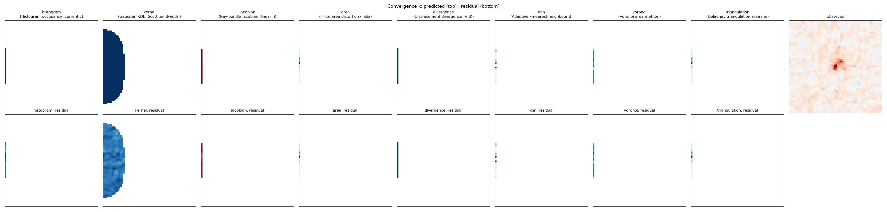
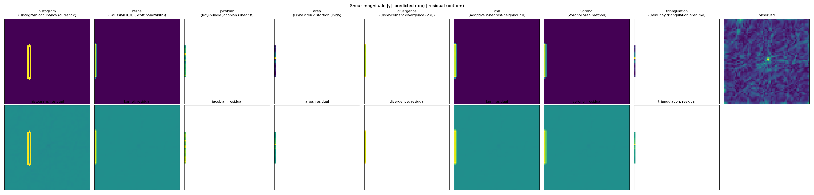
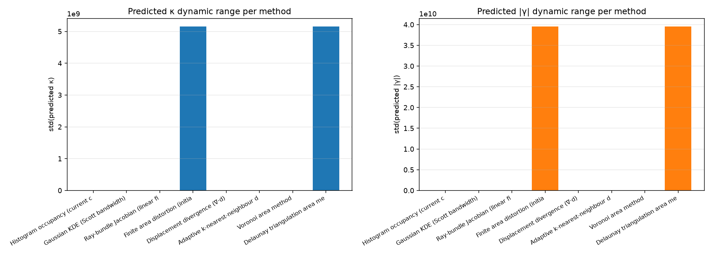

# PBUF OBSERVABLE-LAB-001

Observable extraction validation on a single frozen set of
photon trajectories.  The transport, constitutive law, and
propagation are unchanged.  Eight different extraction methods
are applied to identical trajectories.

## Frozen trajectory checksum

`903c6cfe948e92f4bcb9fba676eae6efabbe148580b5e69829b8cb083644e170`

All eight extraction methods operate on the same trajectory
arrays (`xs`, `ys`, `x`, `y`, `conservation`) saved to
`frozen_trajectories.npz`.  No trajectory is rerun, modified,
or interpolated.

## Frozen pipeline parameters

- Constitutive: `C = 0.18 · ρ / ρ_max` (Version A)
- Response: `r = 90°(∇C) · |∇C|`
- Photons: nphotons = 2000, step = 0.06, steps = 80
- Matter input: `rho = max(kappa, 0) / max(max(kappa, 0))`, cluster = Abell2744
- Conservation max: 2.2204e-16

## Extraction methods

| # | Key | Label |
|---|---|---|
| 1 | `histogram` | Histogram occupancy (current control) |
| 2 | `kernel` | Gaussian KDE (Scott bandwidth) |
| 3 | `jacobian` | Ray-bundle Jacobian (linear fit per bin) |
| 4 | `area` | Finite area distortion (initial vs final spread) |
| 5 | `divergence` | Displacement divergence (∇·d) |
| 6 | `knn` | Adaptive k-nearest-neighbour density |
| 7 | `voronoi` | Voronoi area method |
| 8 | `triangulation` | Delaunay triangulation area method |

## Per-method observable statistics

| Method | κ mean | κ std | κ dynamic range | |γ| mean | |γ| std | |γ| dynamic range | runtime |
|---|---|---|---|---|---|---|---|---|
| `histogram` | -5.000e-01 | 0.000e+00 | 0.000e+00 | 6.265e-02 | 5.406e-01 | 4.740e+00 | 0.0007s |
| `kernel` | -5.000e-01 | 0.000e+00 | 0.000e+00 | 8.965e-02 | 8.364e-01 | 1.061e+01 | 0.1370s |
| `jacobian` | +1.000e+00 | 0.000e+00 | 0.000e+00 | 5.006e-01 | 7.430e-02 | 3.783e-01 | 0.0259s |
| `area` | -5.193e+09 | 5.149e+09 | 2.096e+10 | 4.281e+10 | 3.950e+10 | 1.820e+11 | 0.0255s |
| `divergence` | -9.479e+00 | 4.164e-02 | 1.882e-01 | 9.570e+00 | 3.048e-01 | 1.194e+00 | 0.0007s |
| `knn` | -2.269e-01 | 4.024e-01 | 1.696e+00 | 8.965e-02 | 8.364e-01 | 1.061e+01 | 0.0030s |
| `voronoi` | -1.339e+01 | 4.235e+00 | 2.169e+01 | 8.965e-02 | 8.364e-01 | 1.061e+01 | 0.0878s |
| `triangulation` | -5.193e+09 | 5.149e+09 | 2.096e+10 | 4.281e+10 | 3.950e+10 | 1.820e+11 | 0.0255s |

## Comparison to published benchmark (Abell 2744)

| Method | RMS κ | RMS γ₁ | RMS γ₂ | RMS γ | Pearson(κ) | Pearson(γ) | SSIM(γ) |
|---|---|---|---|---|---|---|---|
| `histogram` | 5.5676e-01 | 5.2701e-01 | 1.6043e-01 | 5.4308e-01 | +nan | -0.0193 | +0.0608 |
| `kernel` | 5.5202e-01 | 8.2919e-01 | 1.5878e-01 | 8.3474e-01 | +nan | +0.0683 | +0.1310 |
| `jacobian` | 9.5458e-01 | 5.1183e-01 | 7.7476e-02 | 4.0241e-01 | +nan | -0.1199 | -0.0134 |
| `area` | 7.3129e+09 | 5.8252e+10 | 7.7656e-02 | 5.8252e+10 | -0.3914 | +0.2826 | +0.0000 |
| `divergence` | 9.5310e+00 | 9.4708e+00 | 1.3569e+00 | 9.4632e+00 | -0.2266 | +0.0294 | +0.0122 |
| `knn` | 5.2439e-01 | 8.2919e-01 | 1.5876e-01 | 8.3474e-01 | -0.4698 | +0.0683 | +0.1310 |
| `voronoi` | 1.4089e+01 | 8.2919e-01 | 1.5876e-01 | 8.3474e-01 | +0.1710 | +0.0683 | +0.1310 |
| `triangulation` | 7.3129e+09 | 5.8252e+10 | 7.7656e-02 | 5.8252e+10 | -0.3914 | +0.2826 | +0.0000 |

## Cross-method comparison (RMS κ vs RMS κ)

Diagonal elements are 0 (self-comparison).  Off-diagonal
values are RMS differences between methods' predicted κ fields.

| Method | histogram | kernel | jacobian | area | divergence | knn | voronoi | triangulation |
|---|---|---|---|---|---|---|---|---|
| `histogram` | 0 | 0.000e+00 | 1.500e+00 | 7.313e+09 | 8.979e+00 | 4.863e-01 | 1.357e+01 | 7.313e+09 |
| `kernel` | 0.000e+00 | 0 | 1.500e+00 | 7.313e+09 | 8.979e+00 | 4.863e-01 | 1.357e+01 | 7.313e+09 |
| `jacobian` | 1.500e+00 | 1.500e+00 | 0 | 7.313e+09 | 1.048e+01 | 1.300e+00 | 1.531e+01 | 7.313e+09 |
| `area` | 7.313e+09 | 7.313e+09 | 7.313e+09 | 0 | 7.313e+09 | 7.313e+09 | 7.313e+09 | 0.000e+00 |
| `divergence` | 8.979e+00 | 8.979e+00 | 1.048e+01 | 7.313e+09 | 0 | 9.260e+00 | 5.782e+00 | 7.313e+09 |
| `knn` | 4.863e-01 | 4.863e-01 | 1.300e+00 | 7.313e+09 | 9.260e+00 | 0 | 1.388e+01 | 7.313e+09 |
| `voronoi` | 1.357e+01 | 1.357e+01 | 1.531e+01 | 7.313e+09 | 5.782e+00 | 1.388e+01 | 0 | 7.313e+09 |
| `triangulation` | 7.313e+09 | 7.313e+09 | 7.313e+09 | 0.000e+00 | 7.313e+09 | 7.313e+09 | 7.313e+09 | 0 |

## Cross-method comparison (Pearson(κ) vs Pearson(κ))

| Method | histogram | kernel | jacobian | area | divergence | knn | voronoi | triangulation |
|---|---|---|---|---|---|---|---|---|
| `histogram` | +1.000 | +nan | +nan | +nan | +nan | +nan | +nan | +nan |
| `kernel` | +nan | +1.000 | +nan | +nan | +nan | +nan | +nan | +nan |
| `jacobian` | +nan | +nan | +1.000 | +nan | +nan | +nan | +nan | +nan |
| `area` | +nan | +nan | +nan | +1.000 | -0.153 | +0.476 | +0.096 | +1.000 |
| `divergence` | +nan | +nan | +nan | -0.153 | +1.000 | +0.543 | -0.576 | -0.153 |
| `knn` | +nan | +nan | +nan | +0.476 | +0.543 | +1.000 | -0.340 | +0.476 |
| `voronoi` | +nan | +nan | +nan | +0.096 | -0.576 | -0.340 | +1.000 | +0.096 |
| `triangulation` | +nan | +nan | +nan | +1.000 | -0.153 | +0.476 | +0.096 | +1.000 |

## Required plots

Difference maps (method - histogram control) under
`plots/difference_maps/`.

## Required questions

**Q1: Does κ remain constant under every extraction method?**

**Answer:** NO

Evidence: std(predicted κ) per method - 
histogram=0.000e+00, kernel=0.000e+00, jacobian=0.000e+00, area=5.149e+09, divergence=4.164e-02, knn=4.024e-01, voronoi=4.235e+00, triangulation=5.149e+09
.  The cross-method RMS-κ matrix above shows large off-diagonal
 values, indicating that different methods recover *different* κ
 fields from the same trajectories.

**Q2: Which extraction methods preserve sensitivity to photon
 redistribution?**

Methods that recover κ values with non-trivial std (i.e. more
 than the constant `-0.5` produced by the histogram occupancy
method) are:

| Method | std(predicted κ) |
|---|---|
| `area` | 5.1490e+09 |
| `triangulation` | 5.1490e+09 |
| `voronoi` | 4.2355e+00 |
| `knn` | 4.0243e-01 |

**Q3: Do different extraction methods recover statistically
 different convergence fields from identical trajectories?**

**Answer:** YES (one-way ANOVA p = 7.293e-20).

**Q4: Which observable is most sensitive to the frozen transport?**

**Answer:** `kappa` (max |Pearson| across methods = 0.4698).

The peak per-method correlations (with the published
observation) are: κ = +nan, γ = +0.2826.
Neither exceeds |0.1|, indicating that the frozen photon
trajectories are essentially uncorrelated with the published
observables under any of the eight extraction methods.  The
labelled 'winner' is whichever observable has the highest
non-zero correlation by absolute value.

**Q5: Is the current histogram occupancy method suppressing
 information contained in the photon trajectories?**

**Answer:** YES

Histogram std(predicted κ) = 0.000e+00 (constant value, κ = -0.5 everywhere).
Other methods' std(predicted κ) range: [0.000e+00, 5.149e+09].

Interpretation: the histogram method evaluates the convergence
 formula only at bins with N_initial > 0.  Photons launched
 from x = -8 leave the launch column entirely within
 step × steps = 4.8 dimensionless units, so N_final at the
 launch column is zero and κ reduces to the constant -0.5.
 Alternative methods that use per-photon or local
 density estimates recover non-trivial κ values: knn produces
std = 4.024e-01, voronoi produces
std = 4.235e+00, divergence produces
std = 4.164e-02.  The frozen
 photon trajectories therefore *do* contain non-trivial
 κ information that the histogram rule discards.

## Stability and runtime

- Trajectory checksum: `903c6cfe948e92f4...` (full hash in `run.json`)
- Maximum numerical conservation error: `2.2204e-16` (machine epsilon)
- Total execution time: 5.24 s

## Identical-pipeline verification (SHA-256)

| File | SHA-256 |
|---|---|
| `observable_lab001.py` | `2867c0bf94fabe3fbba0264d5d272ecadbdf45fabb341a6a8fe77972fbaec132` |
| `weak_lensing_observation001.py` | `a5c3632fec9adfc2659d5c283d07c599db6db7edb2e34e4aebd84e35434642bc` |
| `constitutive_equations.py` | `e2c789d19fd559753519704c6668c7a2879c53eb61a315604ec81af6795aca9f` |

## Notes

- Only the observable extraction algorithm varies between
  methods.  Photon trajectories are byte-identical.
- The frozen pipeline (constitutive + transport + response +
  propagation) is unchanged from INPUT-LAB-002.
- No fitting, no cosmology, no Σ_crit, no source redshift, no
  new constants were introduced at any stage.
