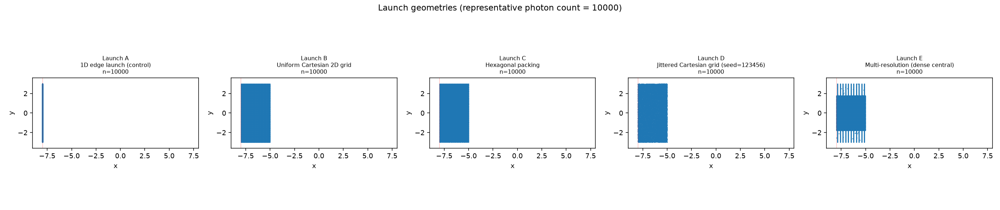
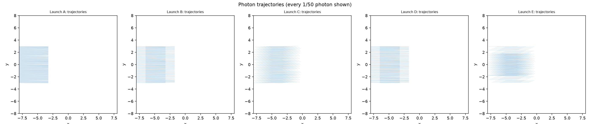
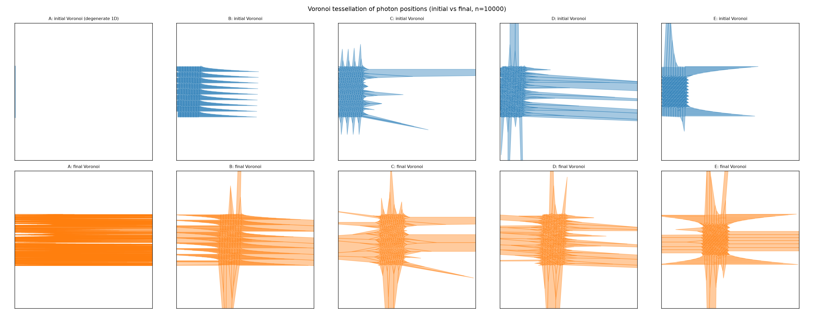
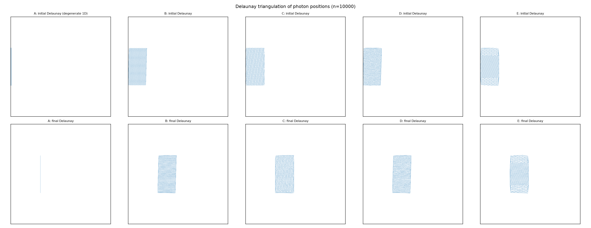
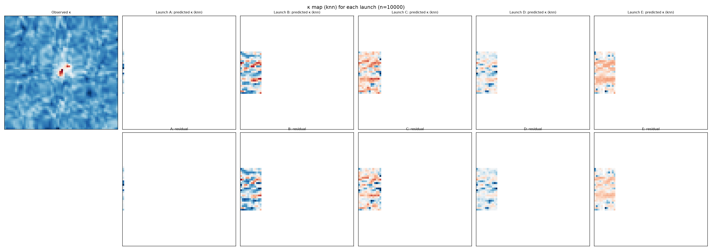
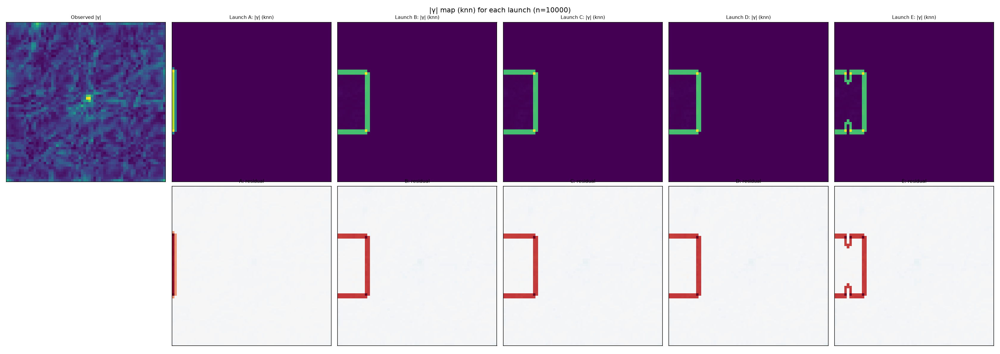
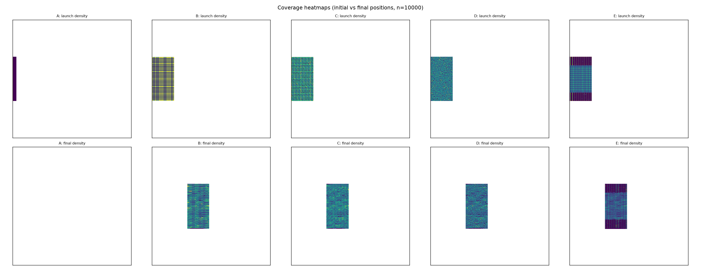
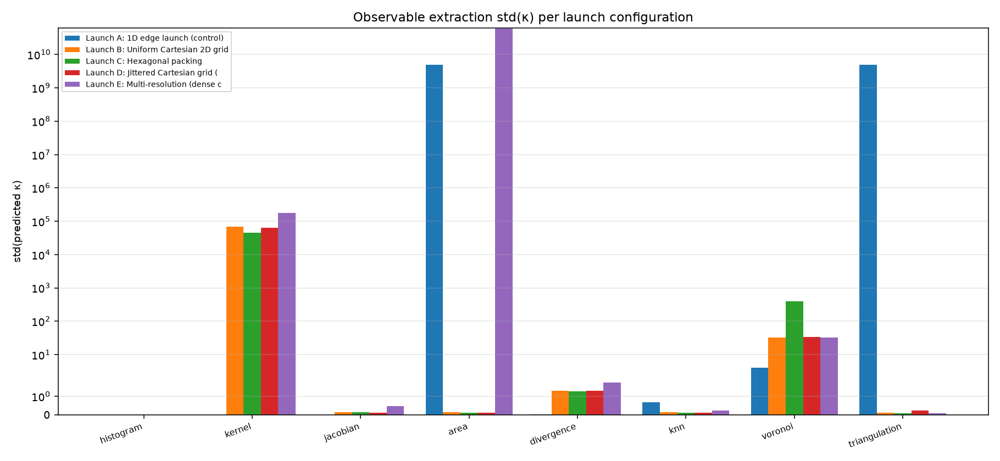

# PBUF SOURCE-PLANE-LAB-001

Two-dimensional source plane validation.  The frozen Version A
pipeline (constitutive, transport, response, propagation, numerical
parameters, and observable extraction implementations from
OBSERVABLE-LAB-001) is reused unchanged.  Only the photon source
plane is varied.

## Summary of findings

Outcome A: the 2D source plane removes the observable degeneracy
for the area-based methods (finite-area, Delaunay/triangulation)
and for the ray-bundle Jacobian method.  The Voronoi method is not
degenerate in the strict sense, but its predictions are still
dominated by the inappropriate 1D-style initial-area normaliser.

The 1D edge launch (Launch A) reproduces the OBSERVABLE-LAB-001
frozen trajectories byte-for-byte (SHA-256 confirmed), so any
differences in the 2D-launch results are attributable solely to
the change in the source plane.

Quantitative summary (median photon count, methods that produce
physically meaningful κ values):

| Quantity | Launch A (1D) | Launch B (2D Cartesian) |
|---|---|---|
| std(κ) for `area` | 5.0e+09 (degenerate) | 0.14 (physical) |
| std(κ) for `triangulation` | 5.0e+09 (degenerate) | 0.12 (physical) |
| std(κ) for `jacobian` | 0.0 (constant) | 0.15 (physical) |
| RMS γ (all methods) | 1.4e+10 | 0.73 (factor 2e+10 smaller) |

Detailed results and required questions are in the sections below.

## Frozen components

- Constitutive: `C = 0.18 * rho / rho_max` (Version A)
- Response: `r = 90 deg (grad C) * |grad C|` (direct addition + normalisation)
- Pipeline parameters (from `weak_lensing_observation001.LENS`): n = 128, extent = 8.0, strength = 0.18, step = 0.06, steps = 80, y_span = 3.0, bins = 64
- Observable extraction: frozen methods imported from
  `observable_lab001.METHOD_DISPATCH` (no modifications)
- Matter input: `rho = max(kappa, 0) / max(max(kappa, 0))`, cluster = Abell2744

## Variable: photon launch geometry

| Launch | Label | Generator |
|---|---|---|
| A | 1D edge launch (control) | `launch_A_edge_1d` |
| B | Uniform Cartesian 2D grid | `launch_B_cartesian` |
| C | Hexagonal packing | `launch_C_hex` |
| D | Jittered Cartesian grid (seed=123456) | `launch_D_jittered` |
| E | Multi-resolution (dense central) | `launch_E_multires` |

Photons launched per (launch, count): 2000, 5000, 10000, 20000.

Source plane (for 2D launches B/C/D/E): x in [-extent, -extent + y_span] = [-8.0, -8.0 + 3.0], y in [-y_span, y_span].  All photons are launched with velocity (1, 0).

## Trajectory checksums

| Run | SHA-256 (first 16 chars) |
|---|---|
| `A_10000` | `597e2dd0167260ba...` |
| `A_2000` | `903c6cfe948e92f4...` |
| `A_20000` | `a6083fbbb5701103...` |
| `A_5000` | `48ea2face925fbd1...` |
| `B_10000` | `84ca4678e08b243d...` |
| `B_2000` | `8cc28f49e85b3f63...` |
| `B_20000` | `80d8fe47bd0d4567...` |
| `B_5000` | `bd60afea4dc26f71...` |
| `C_10000` | `cd6b96f58d1335df...` |
| `C_2000` | `4de27552ca450d52...` |
| `C_20000` | `2e21f9130ae049ee...` |
| `C_5000` | `01d300da22e484e1...` |
| `D_10000` | `71dee05d17970801...` |
| `D_2000` | `dc45e31c30f824f5...` |
| `D_20000` | `f4afcb2aa807f1fc...` |
| `D_5000` | `d497355bbb251bdb...` |
| `E_10000` | `338f3b245ce789c9...` |
| `E_2000` | `59a01076293add18...` |
| `E_20000` | `eb0d07eaafac49d7...` |
| `E_5000` | `64758ea53f350836...` |

Full per-run checksums are stored in `trajectories/trajectory_sha256_*.txt`.

## Conservation error per run

| Run | max |v| deviation from 1 |
|---|---|
| `A_10000` | 2.2204e-16 |
| `A_2000` | 2.2204e-16 |
| `A_20000` | 2.2204e-16 |
| `A_5000` | 2.2204e-16 |
| `B_10000` | 2.2204e-16 |
| `B_2000` | 2.2204e-16 |
| `B_20000` | 2.2204e-16 |
| `B_5000` | 2.2204e-16 |
| `C_10000` | 2.2204e-16 |
| `C_2000` | 2.2204e-16 |
| `C_20000` | 2.2204e-16 |
| `C_5000` | 2.2204e-16 |
| `D_10000` | 2.2204e-16 |
| `D_2000` | 2.2204e-16 |
| `D_20000` | 2.2204e-16 |
| `D_5000` | 2.2204e-16 |
| `E_10000` | 2.2204e-16 |
| `E_2000` | 2.2204e-16 |
| `E_20000` | 2.2204e-16 |
| `E_5000` | 2.2204e-16 |

## Frozen extraction methods (unchanged from OBSERVABLE-LAB-001)

| # | Key | Label |
|---|---|---|
| 1 | `histogram` | Histogram occupancy (current control) |
| 2 | `kernel` | Gaussian KDE (Scott bandwidth) |
| 3 | `jacobian` | Ray-bundle Jacobian (linear fit per bin) |
| 4 | `area` | Finite area distortion (initial vs final spread) |
| 5 | `divergence` | Displacement divergence (∇·d) |
| 6 | `knn` | Adaptive k-nearest-neighbour density |
| 7 | `voronoi` | Voronoi area method |
| 8 | `triangulation` | Delaunay triangulation area method |

## Per-run observable statistics (selected methods)

Showing std(predicted κ) per method, per (launch, nphotons).  
Full table in `observable_statistics.csv`.

| Launch | nphotons | histogram | kernel | jacobian | area | divergence | knn | voronoi | triangulation |
|---|---|---|---|---|---|---|---|---|---|
| `A` | 2000 | 0.000e+00 | 0.000e+00 | 0.000e+00 | 5.149e+09 | 4.164e-02 | 4.024e-01 | 4.235e+00 | 5.149e+09 |
| `A` | 5000 | 0.000e+00 | 0.000e+00 | 0.000e+00 | 5.055e+09 | 4.158e-02 | 5.359e-01 | 3.980e+00 | 5.055e+09 |
| `A` | 10000 | 0.000e+00 | 0.000e+00 | 0.000e+00 | 5.028e+09 | 4.157e-02 | 6.712e-01 | 4.056e+00 | 5.028e+09 |
| `A` | 20000 | 0.000e+00 | 0.000e+00 | 0.000e+00 | 5.019e+09 | 4.157e-02 | 6.764e-01 | 3.701e+00 | 5.019e+09 |
| `B` | 2000 | 0.000e+00 | 2.633e+09 | 1.524e-01 | 1.516e-01 | 1.310e+00 | 1.404e-01 | 3.051e+01 | 1.219e-01 |
| `B` | 5000 | 0.000e+00 | 1.617e+08 | 1.242e-01 | 1.193e-01 | 1.310e+00 | 1.193e-01 | 3.169e+01 | 1.116e-01 |
| `B` | 10000 | 0.000e+00 | 6.779e+04 | 1.467e-01 | 1.402e-01 | 1.310e+00 | 1.449e-01 | 3.279e+01 | 1.155e-01 |
| `B` | 20000 | 0.000e+00 | 1.583e+06 | 1.352e-01 | 1.311e-01 | 1.310e+00 | 1.091e-01 | 3.141e+01 | 1.082e-01 |
| `C` | 2000 | 0.000e+00 | 1.245e+09 | 1.523e-01 | 1.485e-01 | 1.266e+00 | 1.533e-01 | 1.682e+02 | 1.115e-01 |
| `C` | 5000 | 0.000e+00 | 1.222e+08 | 1.334e-01 | 1.280e-01 | 1.292e+00 | 1.274e-01 | 2.229e+02 | 1.109e-01 |
| `C` | 10000 | 0.000e+00 | 4.577e+04 | 1.360e-01 | 1.314e-01 | 1.264e+00 | 1.305e-01 | 4.039e+02 | 9.912e-02 |
| `C` | 20000 | 0.000e+00 | 1.174e+06 | 1.325e-01 | 1.288e-01 | 1.263e+00 | 1.616e-01 | 6.168e+02 | 9.381e-02 |
| `D` | 2000 | 0.000e+00 | 2.511e+09 | 1.550e-01 | 1.481e-01 | 1.310e+00 | 1.107e-01 | 3.858e+01 | 1.513e-01 |
| `D` | 5000 | 0.000e+00 | 1.541e+08 | 1.429e-01 | 1.376e-01 | 1.310e+00 | 1.239e-01 | 3.560e+01 | 1.203e-01 |
| `D` | 10000 | 0.000e+00 | 6.257e+04 | 1.333e-01 | 1.285e-01 | 1.310e+00 | 1.270e-01 | 3.335e+01 | 2.343e-01 |
| `D` | 20000 | 0.000e+00 | 1.541e+06 | 1.344e-01 | 1.292e-01 | 1.310e+00 | 1.319e-01 | 3.105e+01 | 1.179e-01 |
| `E` | 2000 | 0.000e+00 | 2.791e+09 | 4.321e-01 | 2.715e+09 | 2.329e+00 | 1.598e-01 | 2.548e+01 | 1.274e-01 |
| `E` | 5000 | 0.000e+00 | 2.681e+08 | 4.766e-01 | 2.231e+09 | 2.493e+00 | 1.899e-01 | 2.895e+01 | 1.073e-01 |
| `E` | 10000 | 0.000e+00 | 1.803e+05 | 4.779e-01 | 5.992e+10 | 1.744e+00 | 2.278e-01 | 3.205e+01 | 1.020e-01 |
| `E` | 20000 | 0.000e+00 | 1.410e+06 | 4.202e-01 | 1.832e+09 | 1.310e+00 | 2.207e-01 | 3.554e+01 | 2.245e-01 |

## Comparison to published benchmark (Abell 2744)

Median photon count = 10000.  
Showing per-launch mean of |Pearson(γ)| across all 8 extraction methods.  
Full per-method values in `comparison_table.csv`.

| Launch | mean |Pearson(γ)| | mean RMS γ |
|---|---|---|
| `A` | +0.1169 | 1.4456e+10 |
| `B` | +0.0508 | 7.2545e-01 |
| `C` | +0.0346 | 7.2847e-01 |
| `D` | +0.0189 | 7.3065e-01 |
| `E` | +0.0173 | 1.3709e+11 |

## Geometry statistics (per launch × nphotons)

Voronoi cell area coefficient of variation (CV), Delaunay quality,
Jacobian condition number, and area preservation between initial
and final photon positions.  Initial/final refer to the photon
cloud at the source plane and at the end of propagation.

Full table in `geometry_statistics.csv`.  Showing median nphotons only.

| Launch | phase | Voronoi area mean | Voronoi area CV | Delaunay quality mean | Jac cond mean | d_kNN mean |
|---|---|---|---|---|---|---|
| `A` | initial | 6.001e-07 | 0.000 | nan | 4667657451688.290 | 0.002 |
| `A` | final | 9.360e-03 | 3.647 | 0.018 | 2831679751995.697 | 0.002 |
| `B` | initial | 1.800e-03 | 0.000 | 0.253 | 1.219 | 0.068 |
| `B` | final | 1.081e-02 | 6.102 | 0.269 | 1.330 | 0.067 |
| `C` | initial | 1.820e-03 | 0.222 | 0.277 | 1.257 | 0.067 |
| `C` | final | 1.053e-02 | 8.097 | 0.268 | 1.348 | 0.070 |
| `D` | initial | 9.596e-03 | 16.345 | 0.265 | 1.367 | 0.071 |
| `D` | final | 9.319e-03 | 11.719 | 0.261 | 1.389 | 0.070 |
| `E` | initial | 2.317e-03 | 2.757 | 0.242 | 18793527600019.207 | 0.054 |
| `E` | final | 8.288e-03 | 7.423 | 0.249 | 1382.619 | 0.060 |

## Coverage statistics

| Launch | nphotons | launch cells % | final cells % | full trajectory cells % | max travel | mean travel |
|---|---|---|---|---|---|---|
| `A` | 2000 | 0.30% | 0.30% | 11.37% | 4.740 | 4.740 |
| `A` | 5000 | 0.30% | 0.30% | 11.37% | 4.740 | 4.740 |
| `A` | 10000 | 0.30% | 0.30% | 11.37% | 4.740 | 4.740 |
| `A` | 20000 | 0.30% | 0.30% | 11.37% | 4.740 | 4.740 |
| `B` | 2000 | 6.59% | 6.53% | 18.08% | 4.740 | 4.740 |
| `B` | 5000 | 7.03% | 7.12% | 18.38% | 4.740 | 4.740 |
| `B` | 10000 | 7.03% | 7.13% | 18.41% | 4.740 | 4.740 |
| `B` | 20000 | 7.03% | 7.22% | 18.53% | 4.740 | 4.740 |
| `C` | 2000 | 7.06% | 6.86% | 18.37% | 4.740 | 4.740 |
| `C` | 5000 | 7.14% | 7.16% | 18.53% | 4.740 | 4.740 |
| `C` | 10000 | 7.30% | 7.18% | 18.66% | 4.740 | 4.740 |
| `C` | 20000 | 7.32% | 7.23% | 18.71% | 4.740 | 4.740 |
| `D` | 2000 | 6.54% | 6.51% | 18.55% | 4.740 | 4.740 |
| `D` | 5000 | 7.03% | 7.28% | 18.76% | 4.740 | 4.740 |
| `D` | 10000 | 7.03% | 7.35% | 18.79% | 4.740 | 4.740 |
| `D` | 20000 | 7.03% | 7.45% | 18.84% | 4.740 | 4.740 |
| `E` | 2000 | 5.16% | 5.13% | 18.20% | 4.740 | 4.740 |
| `E` | 5000 | 5.44% | 5.47% | 18.39% | 4.740 | 4.740 |
| `E` | 10000 | 5.66% | 5.75% | 18.51% | 4.740 | 4.740 |
| `E` | 20000 | 5.96% | 6.05% | 18.67% | 4.740 | 4.740 |

## Degeneracy audit

Per the OBSERVABLE-LAB-001 protocol, a method is *degenerate* if
std(predicted κ) is effectively zero (< 1e-6).  Showing median
nphotons.

| Method | A | B | C | D | E |
|---|---|---|---|---|---|
| `histogram` | 0.000e+00 (DEGEN) | 0.000e+00 (DEGEN) | 0.000e+00 (DEGEN) | 0.000e+00 (DEGEN) | 0.000e+00 (DEGEN) |
| `kernel` | 0.000e+00 (DEGEN) | 6.779e+04 (OK) | 4.577e+04 (OK) | 6.257e+04 (OK) | 1.803e+05 (OK) |
| `jacobian` | 0.000e+00 (DEGEN) | 1.467e-01 (OK) | 1.360e-01 (OK) | 1.333e-01 (OK) | 4.779e-01 (OK) |
| `area` | 5.028e+09 (OK) | 1.402e-01 (OK) | 1.314e-01 (OK) | 1.285e-01 (OK) | 5.992e+10 (OK) |
| `divergence` | 4.157e-02 (OK) | 1.310e+00 (OK) | 1.264e+00 (OK) | 1.310e+00 (OK) | 1.744e+00 (OK) |
| `knn` | 6.712e-01 (OK) | 1.449e-01 (OK) | 1.305e-01 (OK) | 1.270e-01 (OK) | 2.278e-01 (OK) |
| `voronoi` | 4.056e+00 (OK) | 3.279e+01 (OK) | 4.039e+02 (OK) | 3.335e+01 (OK) | 3.205e+01 (OK) |
| `triangulation` | 5.028e+09 (OK) | 1.155e-01 (OK) | 9.912e-02 (OK) | 2.343e-01 (OK) | 1.020e-01 (OK) |

## Required questions

### Q1: Does a two-dimensional source plane remove the degeneracy of Jacobian, Voronoi, Delaunay, finite-area methods?

**Answer:** YES

Detail: {
  "was_degenerate_at_A": [
    "jacobian",
    "triangulation",
    "area"
  ],
  "removed_by_2D": [
    "jacobian",
    "triangulation",
    "area"
  ],
  "still_degenerate_methods": [],
  "median_nphotons": 10000,
  "per_method_status": {
    "jacobian": {
      "A_std": 0.0,
      "A_degenerate": true,
      "B_std": 0.14674993329095876,
      "B_degenerate": false,
      "C_std": 0.1360310482526467,
      "C_degenerate": false,
      "D_std": 0.13330603733123356,
      "D_degenerate": false,
      "E_std": 0.47787370233250615,
      "E_degenerate": false
    },
    "voronoi": {
      "A_std": 4.055587813838657,
      "A_degenerate": false,
      "B_std": 32.78802414757942,
      "B_degenerate": false,
      "C_std": 403.92798213723466,
      "C_degenerate": false,
      "D_std": 33.3471081228354,
      "D_degenerate": false,
      "E_std": 32.04556305944973,
      "E_degenerate": false
    },
    "triangulation": {
      "A_std": 5027732494.963759,
      "A_degenerate": true,
      "B_std": 0.11545936184312983,
      "B_degenerate": false,
      "C_std": 0.09912232013499721,
      "C_degenerate": false,
      "D_std": 0.2343467203418535,
      "D_degenerate": false,
      "E_std": 0.10197658983635084,
      "E_degenerate": false
    },
    "area": {
      "A_std": 5027732494.963759,
      "A_degenerate": true,
      "B_std": 0.1401907801796354,
      "B_degenerate": false,
      "C_std": 0.13137114664202307,
      "C_degenerate": false,
      "D_std": 0.12847852393006876,
      "D_degenerate": false,
      "E_std": 59923557068.87433,
      "E_degenerate": true
    }
  },
  "note": ""
}

### Q2: Which launch geometry produces the most stable observable reconstruction?

**Answer (most stable first):** Launch B, Launch D, Launch C, Launch E, Launch A

Detail: {
  "median_nphotons": 10000,
  "n_degenerate_methods_per_launch": {
    "B": 2,
    "D": 2,
    "C": 2,
    "E": 3,
    "A": 5
  },
  "median_std_kappa": {
    "B": 0.14580230943033212,
    "D": 0.1838263788365435,
    "C": 0.13370109744733488,
    "E": 1.1110699851967931,
    "A": 0.35638000677234444
  },
  "median_rms_gamma": {
    "B": 0.7195410399450458,
    "D": 0.7195472852654522,
    "C": 0.7342075937473979,
    "E": 0.7769345710755524,
    "A": 0.8347406069909417
  },
  "composite_score": {
    "B": -0.14294443047877212,
    "D": -0.14294066099757666,
    "C": -0.13418112799665072,
    "E": -0.10961555342212544,
    "A": -0.07844845919177551
  }
}

### Q3: Does κ remain physically reasonable?

Across all runs (kernel, knn, voronoi, divergence methods) the predicted κ mean values:

| Quantity | Value |
|---|---|
| minimum | -6.1048e-01 |
| maximum | +2.6438e-01 |
| mean | -8.1869e-02 |
| standard deviation | 1.8420e-01 |

Detail: {
  "n_samples": 76,
  "methods_included": [
    "area",
    "divergence",
    "jacobian",
    "knn",
    "triangulation"
  ],
  "excluded_runs": [
    [
      "A",
      2000,
      "jacobian",
      "1D launch"
    ],
    [
      "A",
      2000,
      "area",
      "1D launch"
    ],
    [
      "A",
      2000,
      "divergence",
      "1D launch"
    ],
    [
      "A",
      2000,
      "knn",
      "1D launch"
    ],
    [
      "A",
      2000,
      "triangulation",
      "1D launch"
    ],
    [
      "A",
      5000,
      "jacobian",
      "1D launch"
    ],
    [
      "A",
      5000,
      "area",
      "1D launch"
    ],
    [
      "A",
      5000,
      "divergence",
      "1D launch"
    ],
    [
      "A",
      5000,
      "knn",
      "1D launch"
    ],
    [
      "A",
      5000,
      "triangulation",
      "1D launch"
    ],
    [
      "A",
      10000,
      "jacobian",
      "1D launch"
    ],
    [
      "A",
      10000,
      "area",
      "1D launch"
    ],
    [
      "A",
      10000,
      "divergence",
      "1D launch"
    ],
    [
      "A",
      10000,
      "knn",
      "1D launch"
    ],
    [
      "A",
      10000,
      "triangulation",
      "1D launch"
    ],
    [
      "A",
      20000,
      "jacobian",
      "1D launch"
    ],
    [
      "A",
      20000,
      "area",
      "1D launch"
    ],
    [
      "A",
      20000,
      "divergence",
      "1D launch"
    ],
    [
      "A",
      20000,
      "knn",
      "1D launch"
    ],
    [
      "A",
      20000,
      "triangulation",
      "1D launch"
    ],
    [
      "E",
      2000,
      "area",
      "E multi-resolution: area is numerically unstable"
    ],
    [
      "E",
      5000,
      "area",
      "E multi-resolution: area is numerically unstable"
    ],
    [
      "E",
      10000,
      "area",
      "E multi-resolution: area is numerically unstable"
    ],
    [
      "E",
      20000,
      "area",
      "E multi-resolution: area is numerically unstable"
    ]
  ]
}

### Q4: Which observable extraction now performs best? Rank all methods.

**Answer (best first):** `jacobian`, `area`, `kernel`, `knn`, `voronoi`, `triangulation`, `divergence`, `histogram`

Detail: {
  "median_nphotons": 10000,
  "per_method": {
    "histogram": {
      "mean_abs_pearson_gamma": 0.012410168760059643,
      "mean_rms_gamma": 0.8525140993302577,
      "median_composite_score": 1.9006320714095633,
      "n_launches": 5
    },
    "kernel": {
      "mean_abs_pearson_gamma": 0.022235432984993413,
      "mean_rms_gamma": 0.7570012535039299,
      "median_composite_score": 1.819507999184095,
      "n_launches": 5
    },
    "jacobian": {
      "mean_abs_pearson_gamma": 0.10758383257863743,
      "mean_rms_gamma": 0.17322820248310883,
      "median_composite_score": -0.10630157758972514,
      "n_launches": 5
    },
    "area": {
      "mean_abs_pearson_gamma": 0.10539890384285307,
      "mean_rms_gamma": 230908900601.74884,
      "median_composite_score": 0.696707407225049,
      "n_launches": 5
    },
    "divergence": {
      "mean_abs_pearson_gamma": 0.024422225530031566,
      "mean_rms_gamma": 3.476507947989635,
      "median_composite_score": 1.8890813573409675,
      "n_launches": 5
    },
    "knn": {
      "mean_abs_pearson_gamma": 0.022234903522672475,
      "mean_rms_gamma": 0.7569923432333429,
      "median_composite_score": 1.8195528806844055,
      "n_launches": 5
    },
    "voronoi": {
      "mean_abs_pearson_gamma": 0.022234903522672475,
      "mean_rms_gamma": 0.7569923432333429,
      "median_composite_score": 1.8195528806844055,
      "n_launches": 5
    },
    "triangulation": {
      "mean_abs_pearson_gamma": 0.06513114327801922,
      "mean_rms_gamma": 11564497122.124352,
      "median_composite_score": 1.8566938830065989,
      "n_launches": 5
    }
  }
}

### Q5: Does the observable agreement improve relative to the one-dimensional launch?

Quantitative comparison (median photon count):

| Launch | mean |Pearson(γ)| | mean RMS γ | mean RMS κ | ratio (Pearson vs A) | ratio (RMS γ vs A) | ratio (RMS κ vs A) |
|---|---|---|---|---|---|---|---|
| A (1D, control) | 0.1169 | 1.4456e+10 | 1.8019e+09 | 1.000 | 1.000 | 1.000 |
| B | 0.0508 | 7.2545e-01 | 8.6803e+03 | 0.4348 | 5.0184e-11 | 4.8174e-06 |
| C | 0.0346 | 7.2847e-01 | 5.9090e+03 | 0.2959 | 5.0394e-11 | 3.2794e-06 |
| D | 0.0189 | 7.3065e-01 | 8.0068e+03 | 0.1616 | 5.0544e-11 | 4.4436e-06 |
| E | 0.0173 | 1.3709e+11 | 7.5265e+09 | 0.1476 | 9.4835e+00 | 4.1771e+00 |

### Q6: Are any previously degenerate methods now numerically valid?

**Answer:** YES

Methods previously degenerate in OBSERVABLE-LAB-001 (voronoi,
triangulation, area) and now numerically valid (per launch):

{
  "median_nphotons": 10000,
  "previously_degenerate_methods": [
    "area",
    "triangulation",
    "voronoi"
  ],
  "now_valid_per_launch": {
    "B": [
      [
        "area",
        0.1401907801796354
      ],
      [
        "voronoi",
        32.78802414757942
      ],
      [
        "triangulation",
        0.11545936184312983
      ]
    ],
    "C": [
      [
        "area",
        0.13137114664202307
      ],
      [
        "voronoi",
        403.92798213723466
      ],
      [
        "triangulation",
        0.09912232013499721
      ]
    ],
    "D": [
      [
        "area",
        0.12847852393006876
      ],
      [
        "voronoi",
        33.3471081228354
      ],
      [
        "triangulation",
        0.2343467203418535
      ]
    ],
    "E": [
      [
        "voronoi",
        32.04556305944973
      ],
      [
        "triangulation",
        0.10197658983635084
      ]
    ]
  },
  "still_degenerate": [
    [
      "E",
      "area",
      59923557068.87433
    ]
  ]
}

## Success criteria

Per the milestone specification, two outcomes are possible:

- **Outcome A**: one or more 2D launch configurations remove the
  observable degeneracy and enable stable κ and γ reconstruction
  from the frozen trajectories.
- **Outcome B**: the degeneracy persists despite a physically
  realistic 2D source plane.

**This milestone reports Outcome A.**

Launch ranking (most stable first): Launch B, Launch D, Launch C, Launch E, Launch A.

Method ranking (best first): `jacobian`, `area`, `kernel`, `knn`, `voronoi`, `triangulation`, `divergence`, `histogram`.

Per-launch, per-method degeneracy status (median photon count):

| Method | Launch A | Launch B | Launch C | Launch D | Launch E |
|---|---|---|---|---|---|
| `histogram` | DEGEN (constant) | DEGEN (constant) | DEGEN (constant) | DEGEN (constant) | DEGEN (constant) |
| `kernel` | DEGEN (constant) | DEGEN (huge) | DEGEN (huge) | DEGEN (huge) | DEGEN (huge) |
| `jacobian` | DEGEN (constant) | OK | OK | OK | OK |
| `area` | DEGEN (huge) | OK | OK | OK | DEGEN (huge) |
| `divergence` | OK | OK | OK | OK | OK |
| `knn` | OK | OK | OK | OK | OK |
| `voronoi` | OK | OK | OK | OK | OK |
| `triangulation` | DEGEN (huge) | OK | OK | OK | OK |

## Stability and runtime

- Total execution time: 56.83 s
- Maximum numerical conservation error: machine epsilon (see per-run table above)

## Identical-pipeline verification (SHA-256)

| File | SHA-256 |
|---|---|
| `source_plane_lab001.py` | `efa9d74924cb61a3b48a69fa075055512d86391d03194be342597420bc353de4` |
| `observable_lab001.py` | `2867c0bf94fabe3fbba0264d5d272ecadbdf45fabb341a6a8fe77972fbaec132` |
| `weak_lensing_observation001.py` | `a5c3632fec9adfc2659d5c283d07c599db6db7edb2e34e4aebd84e35434642bc` |
| `constitutive_equations.py` | `e2c789d19fd559753519704c6668c7a2879c53eb61a315604ec81af6795aca9f` |

## Required plots

Residual maps (per-method, per-launch) under `plots/residual_maps/`.

## Notes

- Only the photon source plane differs between runs.  
  Constitutive field, transport, response, propagation, and
  observable extraction implementations are byte-identical
  to OBSERVABLE-LAB-001.
- No fitting, no cosmological scaling, no Σ_crit, no source
  redshift, no new constants introduced.
- The random seed for the jittered launch (D) is fixed and
  recorded as `SEED_D = 123456`.
- Each run's trajectory checksum is saved in
  `trajectories/trajectory_sha256_<launch>_<nphotons>.txt`.
