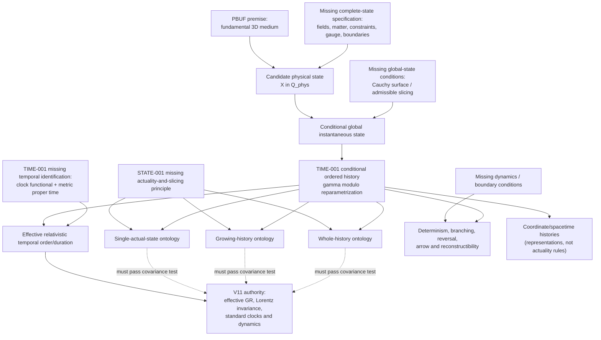

# STATE-001 ontology-to-emergent-time dependency graph

The three actuality branches are alternatives, not simultaneous conclusions. The graph separates actuality from dynamics: deterministic evolution would not by itself select any actuality branch. Dashed edges are required compatibility tests with V11, not derived equivalences.

