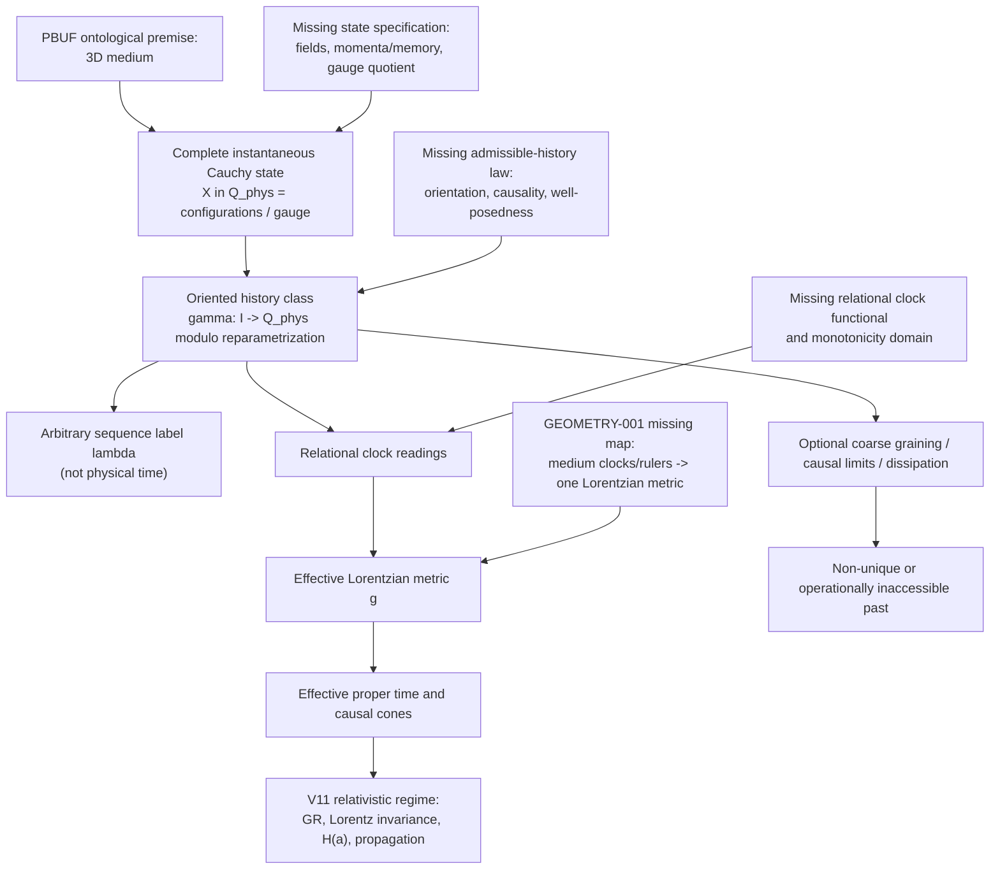

# TIME-001 medium-evolution dependency graph

Solid arrows show required dependencies, not derived field equations. `lambda` is a representation of the history and has no edge to proper time. Past non-reconstructibility is conditional on the additional branch through coarse graining, causal limits, or non-invertibility; it does not follow directly from emergent ordering.

