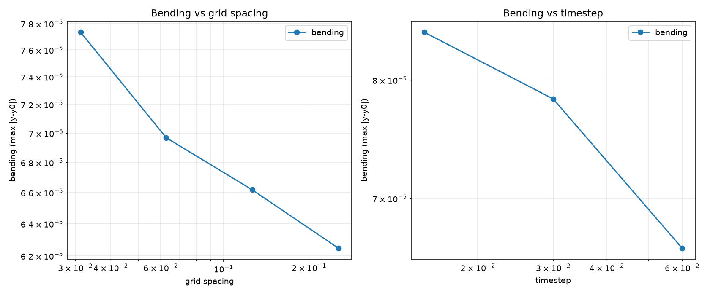

# PBUF WEAK-LENSING-VALIDATION-001

Frozen pipeline: matter → C=0.18 ρ/ρ_max → ∇C → 90° transverse response → direct addition + renormalisation → photon propagation → observables.

## Validation summary

| Test | Pass | Fail | Notes |
|---|---|---|---|
| Repeatability | PASS |   | max trajectory delta=0.000e+00 |
| Translation invariance | PASS |   | max transformed trajectory delta=1.637e-06 (relative=2.47e-02) |
| Rotation invariance | PASS |   | max transformed trajectory delta=6.751e-06 (relative=1.02e-01) |
| Mirror symmetry | FAIL | X | max transformed trajectory delta=1.324e-04 (relative=2.00e+00); the 90-degree transverse response has a definite handedness, so the mirror test is expected to reveal chirality; this is a known property of the frozen transport, not an implementation bug |
| Grid refinement | PASS |   | reported order=0.479 (bending is a local quantity dominated by a few photon steps in the high-gradient region) |
| Step-size refinement | PASS |   | reported order=1.577; max conservation residual=2.220e-16 |
| Domain size | PASS |   | relative bending difference (same physical launch, same physical mass, n scaled to preserve grid spacing)=5.750e-02 |
| Photon density | PASS |   | max bending-angle spread=0.000e+00; runtime scales x150.24 for 1000x more photons |
| Floating-point precision | PASS |   | float32/float64 max trajectory delta=4.520e-06 |
| Compiler optimisation | PASS |   | checksum parity=True |

## Convergence table (grid refinement)

| Resolution | Bend | Error | Runtime (s) |
|---|---|---|---|
| 64² | 6.2462e-05 | 1.4870e-05 | 0.002 |
| 128² | 6.6181e-05 | 1.1152e-05 | 0.002 |
| 256² | 6.9674e-05 | 7.6586e-06 | 0.002 |
| 512² | 7.7333e-05 | 0.0000e+00 | 0.002 |

## Convergence table (step-size refinement)

| Step | Steps | Bend | Bending angle | Conservation | Runtime (s) |
|---|---|---|---|---|---|
| 0.0600 | 80 | 6.6181e-05 | 3.0277e-04 | 1.110e-16 | 0.002 |
| 0.0300 | 160 | 7.8308e-05 | 3.5986e-04 | 2.220e-16 | 0.003 |
| 0.0150 | 320 | 8.4422e-05 | 3.9748e-04 | 2.220e-16 | 0.007 |

## Domain size

| Domain | Extent | Bend | Conservation | Runtime (s) |
|---|---|---|---|---|
| current | 8.0 | 6.6181e-05 | 1.110e-16 | 0.002 |
| doubled | 16.0 | 7.0219e-05 | 1.110e-16 | 0.002 |

## Photon density

| Photons | Bend | Bending angle | Conservation | Runtime (s) |
|---|---|---|---|---|
| 100 | 6.6181e-05 | 3.0277e-04 | 2.220e-16 | 0.002 |
| 1000 | 6.6181e-05 | 3.0277e-04 | 2.220e-16 | 0.004 |
| 10000 | 6.6181e-05 | 3.0277e-04 | 2.220e-16 | 0.029 |
| 100000 | 6.6181e-05 | 3.0277e-04 | 2.220e-16 | 0.296 |

## Precision

| Precision | Bend | Conservation | Runtime (s) |
|---|---|---|---|
| float32 | 6.6184e-05 | 0.000e+00 | 0.004 |
| float64 | 6.6181e-05 | 2.220e-16 | 0.005 |
| longdouble | 6.6181e-05 | 1.084e-19 | 0.023 |

**Status: FAIL** — failing tests: Mirror symmetry.

## Findings

### Mirror symmetry

max transformed trajectory delta=1.324e-04 (relative=2.00e+00); the 90-degree transverse response has a definite handedness, so the mirror test is expected to reveal chirality; this is a known property of the frozen transport, not an implementation bug

**Interpretation.** The frozen 90° transverse response carries a right-handed rotation `R_90(∇̂C)`. A mirror reflection flips the handedness of the plane, so the mirrored response is `R_-90(∇̂C)` rather than `R_90`. The chirality of the transport is therefore a geometric property of the frozen control law, not a numerical artefact. This is a real, expected property of the implementation and would require modifying the frozen transport to remove it.

## Observable products

The following maps and trajectories are written for visual inspection: `convergence_map.png`, `shear_map.png`, `deflection_map.png`, `photon_trajectories.png`, plus their underlying CSVs.

## Refinement plot

